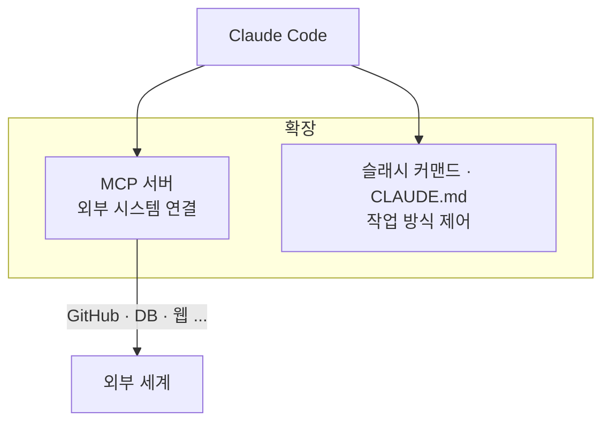

> **TL;DR** — Claude Code의 확장은 두 축입니다: **MCP 서버**(외부 시스템과 연결)와 **슬래시 커맨드·CLAUDE.md**(작업 방식 제어). 핵심은 "많이 붙이는 것"이 아니라 **필요한 것만 붙이는 것**입니다. MCP 도구가 많을수록 컨텍스트가 무거워지고 모델이 선택에 혼란을 겪기 때문입니다. 이 글은 각 플러그인을 "왜·언제 쓰는지" 기준으로 정리합니다.

---

## 1. 확장의 두 축



- **MCP 서버**는 Claude가 **환경에 영향을 주는 통로**입니다. GitHub에 PR을 만들거나 DB를 조회하는 등 외부 시스템과 연결합니다.
- **슬래시 커맨드·CLAUDE.md**는 Claude의 **작업 방식**을 제어합니다. 프로젝트 규칙을 주입하거나 반복 워크플로우를 커맨드로 묶습니다.

> **가장 중요한 원칙**: MCP는 필요한 것만 붙이세요. 도구가 많을수록 매 요청에 모든 도구 스키마가 컨텍스트에 실려 비용이 오르고, 모델이 어떤 도구를 쓸지 헷갈립니다. "일단 다 깔아두기"는 오히려 성능을 떨어뜨립니다.

---

## 2. MCP 서버 — 언제 어떤 걸 붙이나

MCP(Model Context Protocol)는 `claude mcp add`로 설치합니다. 아래는 **실제로 그 통합이 필요할 때만** 붙이는 걸 전제로 한 목록입니다.

### 거의 항상 유용 — GitHub

| 플러그인 | 왜 붙이나 | 언제 |
|---|---|---|
| **github** | PR 생성·리뷰·이슈 관리를 Claude가 직접 수행 | 코드 작업이 GitHub 기반이면 사실상 필수 |

```bash
claude mcp add github -e GITHUB_TOKEN=your_token
```

GitHub MCP는 Claude Code 워크플로우의 핵심입니다. "이 변경 PR로 올려줘", "이 이슈 고쳐줘" 같은 요청이 실제 동작으로 이어집니다.

### 데이터가 DB에 있을 때 — postgres / sqlite

| 플러그인 | 왜 붙이나 | 주의 |
|---|---|---|
| **postgres** | 스키마 조회·쿼리를 Claude가 직접 실행 | **읽기 전용 계정**으로 붙이는 걸 권장 |
| **sqlite** | 로컬 DB 파일 직접 읽기·쓰기 | 프로토타입·로컬 데이터 분석에 적합 |

DB MCP는 "이 테이블 구조 보고 마이그레이션 짜줘" 같은 작업에서 강력합니다. 단, **쓰기 권한을 주면 Claude가 데이터를 변경할 수 있으니** 프로덕션 DB엔 읽기 전용 계정을 쓰세요.

### 웹 정보가 필요할 때 — 검색·페치

| 플러그인 | 왜 붙이나 | 언제 |
|---|---|---|
| **brave-search** | 최신 정보·문서 웹 검색 | 학습 시점 이후 정보가 필요할 때 |
| **fetch** | 특정 URL 콘텐츠 가져오기 | 문서·API 스펙 페이지를 참조시킬 때 |
| **puppeteer** | 브라우저 자동화·스크린샷 | UI 동작 확인, 스크린샷 기반 작업 |

### 협업 도구 연동 — 필요할 때만

| 플러그인 | 왜 붙이나 | 언제 |
|---|---|---|
| **slack** | 메시지 조회·전송 | 봇·알림 자동화를 만들 때 |
| **google-drive** | Drive 문서 접근 | 문서가 Drive에 있을 때 |
| **memory** | 세션 간 지식 그래프 유지 | 장기 컨텍스트가 중요한 작업 |

> 협업 도구 MCP는 **그 통합이 이번 작업에 실제로 쓰일 때만** 붙이세요. Slack을 쓸 일이 없는데 Slack MCP를 붙여두면 컨텍스트만 차지합니다.

### 설치·관리 명령

```bash
claude mcp list          # 설치된 MCP 목록
claude mcp add <name>    # 추가
claude mcp remove <name> # 제거 — 안 쓰는 건 지우는 게 낫다
```

---

## 3. 슬래시 커맨드 — 반복 작업을 묶기

Claude Code 기본 제공 커맨드부터 익히세요.

| 커맨드 | 설명 | 언제 |
|---|---|---|
| `/init` | 코드베이스 분석 후 `CLAUDE.md` 자동 생성 | 새 프로젝트 시작 시 첫 단계 |
| `/code-review` | 현재 변경사항 코드 리뷰 | 커밋·PR 전 |
| `/plan` (plan mode) | 계획 수립 후 승인받고 구현 | 큰 작업 시작 전 |

`/init`은 특히 중요합니다 — 프로젝트에 진입하면 가장 먼저 실행해 `CLAUDE.md` 초안을 만드세요.

---

## 4. CLAUDE.md — 가장 강력한 "플러그인"

사실 가장 효과가 큰 확장은 MCP가 아니라 **`CLAUDE.md`**입니다. 프로젝트 루트에 두면 Claude가 매 세션 자동으로 읽어, 매번 설명하던 컨텍스트를 없애줍니다.

```markdown
# 프로젝트 규칙

## 기술 스택
- TypeScript strict mode, Node 20
- 테스트: Jest, 커버리지 80% 이상

## 주의
- `migrations/`는 수정 금지 — 새 마이그레이션 파일 생성
- 커밋 메시지는 Conventional Commits 형식, 한국어로

## 개발 명령어
- 테스트: `npm test`
- 린트: `npm run lint`
```

> `CLAUDE.md`를 어떻게 써야 효과적인지는 별도 글에서 깊게 다뤘습니다 — [Claude Code CLAUDE.md 작성 전략](/posts/claude-code-claude-md-strategy/)

---

## 5. 함정 / 흔한 실수

### "MCP를 많이 깔수록 강력하다"

반대입니다. MCP 도구 스키마는 **매 요청마다 컨텍스트에 실립니다.** 20개를 깔면 20개 분의 설명이 매번 로드되어 비용이 오르고, 모델은 "이 중 뭘 써야 하지" 고민하느라 정확도가 떨어집니다. **이번 작업에 필요한 것만** 붙이고, 안 쓰면 `claude mcp remove`로 지우세요.

### "DB MCP에 쓰기 권한을 준다"

프로덕션 DB에 쓰기 가능한 계정으로 MCP를 붙이면, Claude가 실수로(또는 프롬프트 인젝션으로) 데이터를 변경할 수 있습니다. **읽기 전용 계정**이 기본입니다.

### "CLAUDE.md 없이 MCP만 붙인다"

MCP는 능력을 넓히지만, `CLAUDE.md`가 없으면 Claude는 매번 프로젝트 맥락을 처음부터 파악해야 합니다. **CLAUDE.md가 먼저, MCP는 그다음**입니다.

---

## 마무리

Claude Code 확장의 핵심은 **"무엇을 붙이나"가 아니라 "무엇을 안 붙이나"**입니다.

1. **CLAUDE.md 먼저** — 가장 큰 효과, 비용 0
2. **GitHub MCP** — 코드 작업 기반이면 사실상 필수
3. **나머지 MCP** — 이번 작업에 실제로 쓰일 때만, 끝나면 제거

도구는 적고 명확할수록 좋습니다. 필요할 때 붙이고, 안 쓰면 지우세요.

---

도움이 됐다면 [GitHub](https://github.com/taengkim)에서 확인해보세요!
