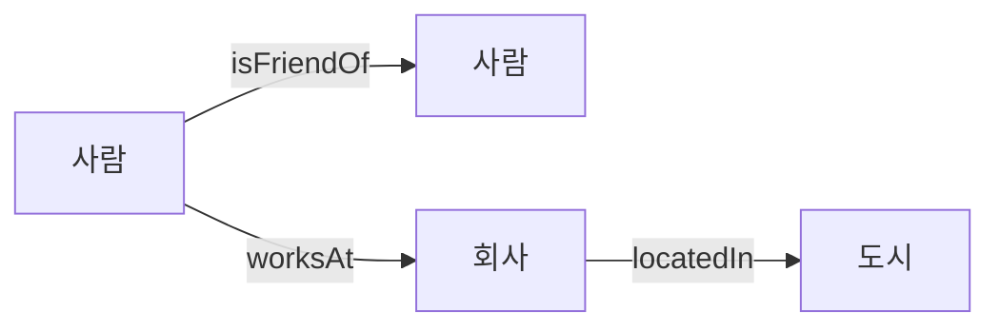
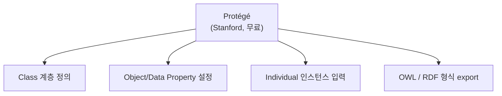
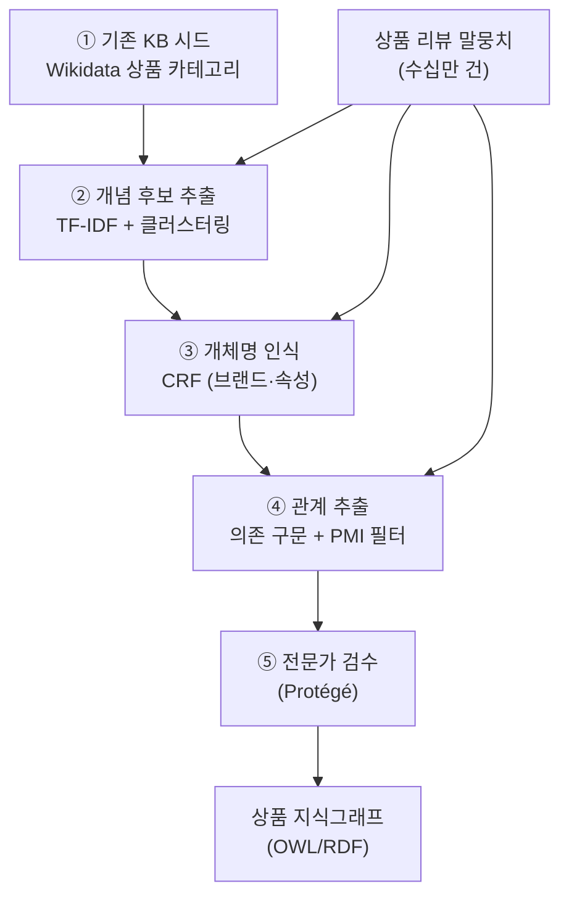

> **TL;DR** — LLM은 온톨로지 구축에 강력하지만 비용·보안·성능 제약으로 못 쓰는 경우가 많습니다. **도메인이 좁고 표현 패턴이 명확할수록 전통 기법이 LLM보다 빠르고 정확**합니다. 이 글은 7가지 기법을 정리하고, 마지막에 이들을 **하나의 파이프라인으로 조합한 실무 사례**를 보여줍니다.

LLM이 온톨로지 구축에 강력한 도구이긴 하지만, 비용·보안·성능 제약으로 사용하지 못하는 경우가 있습니다.  
이 글에서는 LLM 없이 온톨로지를 구축할 수 있는 대표적인 기법들을 소개하고, **실무에서 어떻게 조합하는지**까지 다룹니다.

---

## 온톨로지란?

온톨로지(Ontology)는 **개념(Concept)**, **관계(Relation)**, **속성(Attribute)** 을 정형화한 지식 표현 체계입니다.



---

## 1. 수동 온톨로지 엔지니어링 (Manual Engineering)

가장 전통적인 방법으로, 도메인 전문가가 직접 개념과 관계를 정의합니다.

### 대표 도구: Protégé



**장점:** 정확도 높음, 도메인 특화 가능  
**단점:** 시간·비용이 많이 들고 확장성 낮음

---

## 2. 규칙 기반 정보 추출 (Rule-based IE)

텍스트에서 패턴 규칙을 정의해 개념과 관계를 자동 추출합니다.

### 정규표현식 패턴

```python
import re

# "A는 B의 일종이다" 패턴으로 IS-A 관계 추출
pattern = r"(.+?)는 (.+?)의 일종"
text = "고양이는 포유류의 일종이다"

match = re.search(pattern, text)
if match:
    child, parent = match.group(1), match.group(2)
    print(f"IS-A: {child} → {parent}")
# IS-A: 고양이 → 포유류
```

### Stanford CoreNLP / spaCy 패턴 매칭

```python
import spacy
from spacy.matcher import Matcher

nlp = spacy.load("ko_core_news_sm")
matcher = Matcher(nlp.vocab)

# "A가 B를 생산한다" 패턴
pattern = [
    {"DEP": "nsubj"},
    {"LEMMA": "생산하다"}
]
matcher.add("PRODUCE", [pattern])
```

**적합한 경우:** 특정 도메인, 고정된 표현 패턴이 많을 때

---

## 3. 통계 기반 NLP

### 3-1. TF-IDF + 클러스터링으로 개념 후보 추출

```python
from sklearn.feature_extraction.text import TfidfVectorizer
from sklearn.cluster import KMeans

# 말뭉치에서 핵심 용어 추출
vectorizer = TfidfVectorizer(max_features=500)
X = vectorizer.fit_transform(corpus)
terms = vectorizer.get_feature_names_out()

# 유사 개념 클러스터링
kmeans = KMeans(n_clusters=20)
kmeans.fit(X.T)  # 용어 기준 클러스터링
```

### 3-2. PMI (점별 상호정보량) 로 관계 추출

단어 간 공기(co-occurrence)를 측정해 의미적 연관성을 계산합니다.

```
PMI(A, B) = log( P(A,B) / P(A)×P(B) )

PMI > 0  → 유의미한 연관 관계
PMI ≤ 0  → 무관
```

```python
from collections import Counter
import numpy as np

def pmi(word_a, word_b, cooccurrence, word_count, total):
    p_ab = cooccurrence[(word_a, word_b)] / total
    p_a  = word_count[word_a] / total
    p_b  = word_count[word_b] / total
    if p_ab == 0:
        return 0
    return np.log(p_ab / (p_a * p_b))
```

---

## 4. 형식 개념 분석 (Formal Concept Analysis, FCA)

객체(Object)와 속성(Attribute)의 관계에서 **개념 격자(Concept Lattice)** 를 자동 생성합니다.

```
객체-속성 테이블:
         날개 | 다리 | 비늘 | 털
독수리    O  |  O  |  X  | X
뱀        X  |  X  |  O  | X
호랑이    X  |  O  |  X  | O

→ {독수리, 호랑이}의 공통 속성: {다리} → "다리가 있는 동물" 개념 자동 생성
```

**Python 라이브러리:** `concepts`, `fcapy`

```python
from concepts import Context

c = Context.fromstring("""
     |날개|다리|비늘|털|
독수리|X   |X   |   | |
뱀    |    |    |X  | |
호랑이|    |X   |   |X|
""")

for concept in c.lattice:
    print(concept)
```

---

## 5. 머신러닝 기반 개체명 인식 (NER)

### CRF (Conditional Random Field)

시퀀스 레이블링에 강한 전통 ML 모델입니다. 작은 도메인 데이터로도 훈련 가능합니다.

```python
import sklearn_crfsuite

crf = sklearn_crfsuite.CRF(
    algorithm='lbfgs',
    c1=0.1,
    c2=0.1,
    max_iterations=100
)
crf.fit(X_train, y_train)

# BIO 태깅으로 개체명 추출
# B-CONCEPT, I-CONCEPT, O
```

### SVM 기반 관계 분류

두 개체 사이의 관계 유형을 분류합니다.

```python
from sklearn.svm import SVC

# 피처: 단어 간 거리, POS 태그, 의존 관계 경로
relation_clf = SVC(kernel='rbf')
relation_clf.fit(X_relations, y_relations)
# 출력: IS-A, PART-OF, HAS-PROPERTY, ...
```

---

## 6. 기존 온톨로지/지식베이스 활용

처음부터 만들지 않고 기존 자원을 재활용합니다.

| 자원 | 설명 | 용도 |
|---|---|---|
| **WordNet** | 영어 어휘 의미망 | 상위어/하위어 관계 |
| **DBpedia** | Wikipedia 구조화 데이터 | 인스턴스 및 관계 |
| **Wikidata** | 오픈 지식 그래프 | 범용 사실 관계 |
| **SNOMED CT** | 의료 온톨로지 | 의료 도메인 |
| **한국어 WordNet** | KorLex | 한국어 어휘 관계 |

```python
# Wikidata SPARQL 쿼리로 관계 추출
query = """
SELECT ?item ?itemLabel ?instanceOf ?instanceOfLabel WHERE {
  ?item wdt:P31 ?instanceOf.
  ?item rdfs:label "고양이"@ko.
  SERVICE wikibase:label { bd:serviceParam wikibase:language "ko". }
}
"""
```

---

## 7. 의존 구문 분석 기반 관계 추출

문장의 문법 구조에서 주어-서술어-목적어 관계를 추출합니다.

```python
import spacy

nlp = spacy.load("ko_core_news_sm")
doc = nlp("삼성전자는 갤럭시 스마트폰을 생산한다.")

for token in doc:
    if token.dep_ == "nsubj":
        subject = token.text
    if token.dep_ == "obj":
        obj = token.text
    if token.pos_ == "VERB":
        predicate = token.text

# 삼성전자 --생산하다--> 갤럭시 스마트폰
# Triple: (삼성전자, 생산하다, 갤럭시 스마트폰)
```

---

## 기법 선택 가이드

| 상황 | 추천 기법 |
|---|---|
| 도메인 전문가 있음, 소규모 | 수동 엔지니어링 (Protégé) |
| 패턴이 명확한 도메인 텍스트 | 규칙 기반 (정규식 + 패턴) |
| 대용량 비정형 텍스트 | TF-IDF + 클러스터링, PMI |
| 레이블 데이터 확보 가능 | CRF, SVM NER |
| 속성-객체 행렬 데이터 | FCA |
| 기존 지식이 있는 도메인 | DBpedia / Wikidata 재활용 |

---

## 8. 실무 사례 — 전자상거래 상품 온톨로지 파이프라인

단일 기법으로는 부족합니다. 실무에서는 **여러 기법을 단계로 엮어** 씁니다. 상품 리뷰 말뭉치에서 상품 온톨로지를 만드는 예를 봅시다.



각 단계가 앞의 기법에 정확히 대응합니다:

| 단계 | 기법 | 하는 일 |
|---|---|---|
| ① 시드 | **기존 KB 활용** (6절) | Wikidata에서 상품 상위 카테고리를 뼈대로 가져옴 |
| ② 개념 후보 | **TF-IDF + 클러스터링** (3절) | 리뷰에서 자주 등장하는 용어를 개념 후보로 |
| ③ 개체 인식 | **CRF NER** (5절) | "삼성", "OLED", "방수" 같은 브랜드·속성 태깅 |
| ④ 관계 추출 | **의존 구문 + PMI** (3·7절) | "갤럭시 → has → OLED" 트리플 추출, PMI로 노이즈 제거 |
| ⑤ 검수 | **수동 엔지니어링** (1절) | Protégé로 자동 추출 결과를 전문가가 확정 |

### 왜 이 순서인가

- **시드를 먼저** 깔면 이후 추출이 방향을 잃지 않습니다(빈 캔버스보다 뼈대가 있는 게 낫다).
- **PMI를 관계 추출의 필터로** 쓰는 게 핵심입니다. 의존 구문만으로는 "리뷰어 → 좋아하다 → 색상" 같은 무의미한 트리플이 대량 나오는데, PMI로 통계적 연관이 낮은 것을 걸러냅니다.
- **마지막은 반드시 사람**입니다. 자동 추출은 후보를 만들 뿐, 온톨로지의 신뢰성은 검수 단계에서 나옵니다.

> 이 파이프라인은 **LLM 한 번 호출 없이** 돌아갑니다. 리뷰가 수백만 건이어도 비용은 컴퓨팅 자원뿐이고, 데이터가 외부로 나가지 않아 보안 제약이 있는 도메인(의료·금융)에 특히 적합합니다.

---

## 정리

LLM 없이도 목적과 상황에 따라 충분히 온톨로지를 구축할 수 있습니다.  
특히 **도메인이 좁고 패턴이 명확**할수록 전통 기법이 LLM보다 오히려 빠르고 정확한 경우도 많습니다.

핵심은 단일 기법이 아니라 **조합**입니다:

1. **기존 KB로 뼈대** 확보 (바닥부터 만들지 말 것)
2. **통계·ML로 후보** 자동 추출 (TF-IDF, CRF, 의존 구문)
3. **PMI 등으로 노이즈 제거** (자동 추출의 최대 약점 보완)
4. **전문가 검수로 확정** (신뢰성은 여기서 나온다)

자동 추출 결과를 전문가가 검수하는 **반자동(Semi-automatic)** 방식이 가장 현실적입니다.

---

더 궁금한 점은 [GitHub](https://github.com/taengkim)에서 이슈로 남겨주세요!
