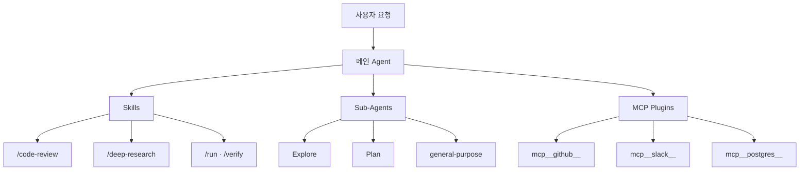
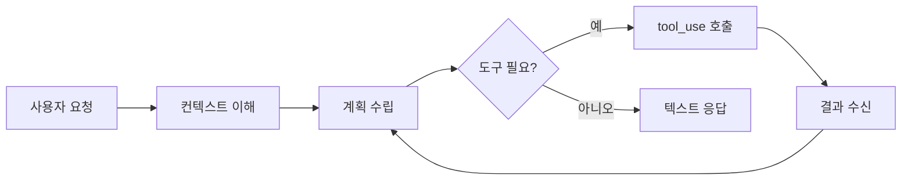
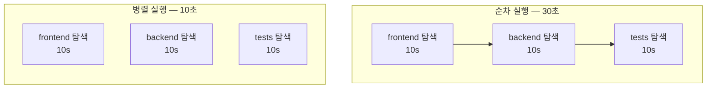
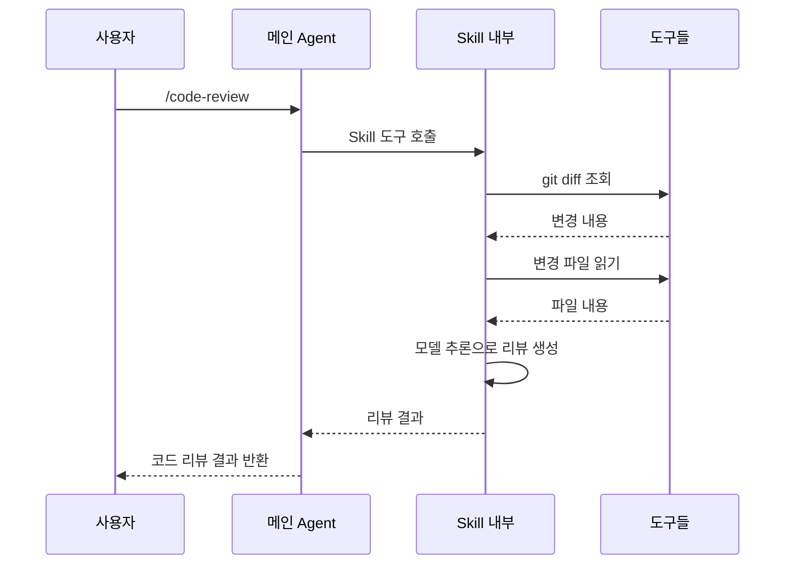
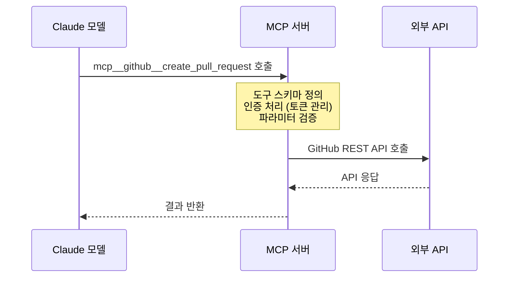
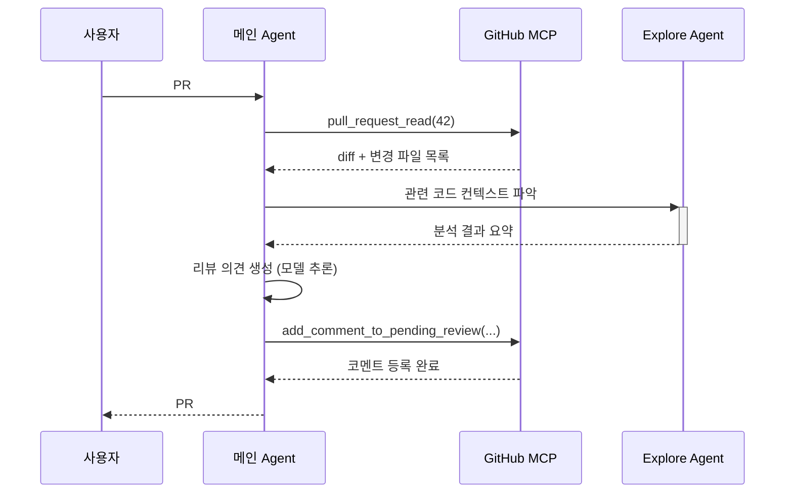
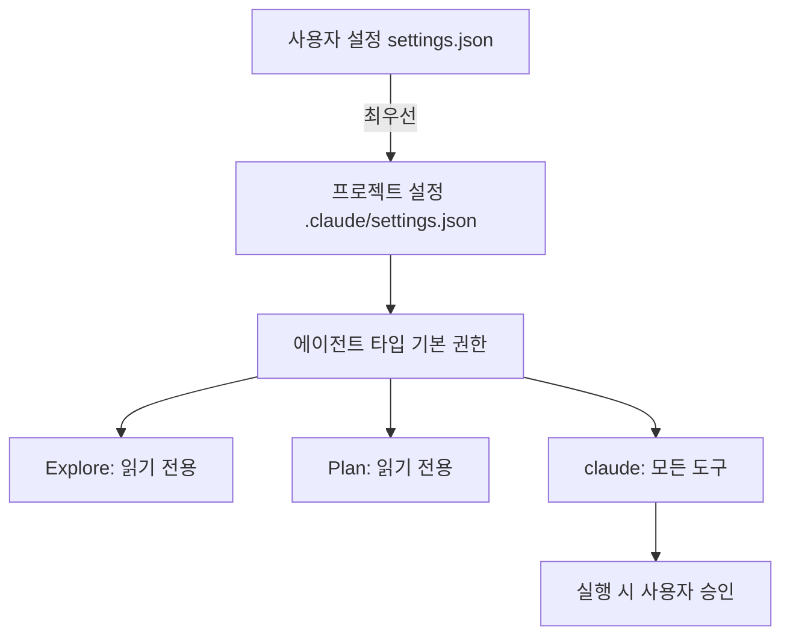

> **TL;DR** Claude Code는 모델(추론)·서브 에이전트(병렬·전문화)·스킬(재사용 워크플로우)·MCP 플러그인(외부 서비스 연결)의 네 계층이 하나의 대화 루프 안에서 조합된다. 모델이 판단하고, 에이전트가 병렬로 실행하며, 스킬이 복잡한 흐름을 캡슐화하고, MCP가 외부 세계와 연결한다.
{: .prompt-info }

> AI 에이전트가 소비하는 데이터 구조가 궁금하다면 → [AI-Ready Data: 개념·구성요소·동작 방식·실제 구동 예](/posts/ai-ready-data/)
{: .prompt-tip }

---

## 전체 구조



| 계층 | 역할 | 예시 |
|---|---|---|
| **모델 (Model)** | 추론·판단·코드 생성 | Claude Sonnet, Opus, Haiku |
| **스킬 (Skill)** | 재사용 가능한 작업 흐름 | `/code-review`, `/deep-research` |
| **플러그인 (MCP)** | 외부 서비스 연결 | GitHub, DB, 웹 검색 |

---

## 1. 모델 계층

모델은 전체 구조의 **두뇌**다. 사용자의 자연어 요청을 이해하고, 어떤 도구(Tool)를 어떤 순서로 사용할지 결정한다.

### 모델 선택 기준

| 모델 | 특징 | 적합한 작업 |
|---|---|---|
| **Opus 4.8** | 최고 성능, 복잡한 추론 | 대규모 리팩토링, 아키텍처 설계 |
| **Sonnet 4.6** | 균형잡힌 속도·성능 | 일반 코드 작업, 버그 수정 |
| **Haiku 4.5** | 빠른 응답, 경량 | 간단한 질의, 빠른 수정 |

### 모델의 실행 사이클



모델은 직접 코드를 실행하거나 파일을 수정하지 않는다. 반드시 **도구(Tool) 호출**을 통해서만 환경에 영향을 줄 수 있다.

---

## 2. 에이전트 시스템

### 서브 에이전트 종류

| 에이전트 타입 | 용도 | 도구 권한 |
|---|---|---|
| `claude` | 범용 작업 처리 | 모든 도구 |
| `Explore` | 코드베이스 탐색·검색 | 읽기 전용 |
| `Plan` | 구현 계획 설계 | 읽기 전용 |
| `general-purpose` | 복잡한 멀티스텝 작업 | 모든 도구 |
| `claude-code-guide` | Claude Code API 관련 질문 | 검색·읽기 |

### 병렬 실행으로 시간 단축



### 실제 서브 에이전트 활용 예

```
사용자: "src 디렉토리에서 deprecated API 사용 찾아줘"
         ↓
메인 Agent:
  → 코드베이스 전체 탐색 필요 → [Agent: Explore] 생성
  → 프롬프트: "src/**에서 @deprecated 패턴 검색. 파일·라인 번호 목록 반환."

[Agent: Explore] 독립 컨텍스트에서 실행:
  → Glob("src/**/*.ts") 실행
  → Grep("@deprecated|deprecatedMethod") 실행
  → 결과 요약만 메인 에이전트에 반환 (컨텍스트 보호)
         ↓
메인 Agent: 결과 정리 후 사용자에게 전달
```

서브 에이전트는 **독립된 컨텍스트**에서 실행된다. 대량 파일 읽기 결과가 메인 컨텍스트 창을 채우지 않도록 보호한다.

---

## 3. 스킬 시스템

스킬은 **반복적으로 사용되는 복잡한 작업 흐름**을 패키지화한 것이다.  
`/skill-name` 형태의 슬래시 커맨드로 호출한다.

### 주요 스킬 목록

| 스킬 | 호출 방법 | 설명 |
|---|---|---|
| **deep-research** | `/deep-research` | 웹 검색·출처 검증·보고서 작성 |
| **code-review** | `/code-review` | 현재 변경사항 코드 리뷰 |
| **security-review** | `/security-review` | 보안 취약점 검토 |
| **run** | `/run` | 앱 실행 및 동작 확인 |
| **verify** | `/verify` | 변경사항 실제 동작 검증 |
| **init** | `/init` | CLAUDE.md 초기화 |
| **simplify** | `/simplify` | 코드 단순화·리팩토링 |
| **update-config** | `/update-config` | settings.json 설정 변경 |
| **loop** | `/loop 30m /code-review` | 주기적 반복 작업 설정 |

### 스킬 실행 흐름



### 실제 사용 예시

```bash
# 기본 코드 리뷰
/code-review

# 높은 강도로 리뷰 (버그 + 최적화 + 보안)
/code-review --effort high

# 인라인 PR 코멘트로 결과 게시
/code-review --comment

# 딥 리서치
/deep-research "Apache Iceberg vs Delta Lake 성능 비교 2026"

# 30분마다 코드 리뷰 반복
/loop 30m /code-review
```

---

## 4. MCP 플러그인 시스템

### MCP란?

**Model Context Protocol**의 약자. AI 모델이 외부 서비스와 통신하기 위한 표준 프로토콜이다.  
Claude Code에서 플러그인은 `mcp__{서버명}__{기능명}` 형태의 도구로 노출된다.

```bash
# MCP 도구 이름 규칙
mcp__{서버명}__{기능명}

# 예시
mcp__github__create_pull_request
mcp__github__get_file_contents
mcp__slack__send_message
mcp__postgres__query
```

### MCP 서버 동작 구조



### 주요 MCP 플러그인

**개발 협업**

| 플러그인 | 제공 도구 예시 |
|---|---|
| `github` | PR 생성·조회, 이슈 관리, 코드 검색, 브랜치 조작 |
| `gitlab` | MR 생성, 파이프라인 트리거 |
| `jira` | 이슈 생성·업데이트 |

**데이터베이스**

| 플러그인 | 제공 도구 예시 |
|---|---|
| `postgres` | SQL 쿼리 실행, 스키마 조회 |
| `sqlite` | 로컬 DB 읽기·쓰기 |
| `mysql` | 테이블 조회, 데이터 수정 |

**검색 & 웹**

| 플러그인 | 제공 도구 예시 |
|---|---|
| `brave-search` | 웹 검색 |
| `fetch` | URL 콘텐츠 가져오기 |
| `puppeteer` | 브라우저 자동화, 스크린샷 |

### MCP 설치 방법

```bash
# GitHub MCP 설치 (토큰 필요)
claude mcp add github -e GITHUB_TOKEN=your_token

# PostgreSQL MCP 설치
claude mcp add postgres -e DATABASE_URL=postgresql://...

# 설치된 MCP 목록 확인
claude mcp list
```

---

## 5. 세 계층의 연동: PR 리뷰 전체 흐름

"이 PR의 코드를 리뷰하고 GitHub에 코멘트를 달아줘"라는 요청의 end-to-end 흐름이다.



---

## 6. 컨텍스트 격리와 권한

### 서브 에이전트 격리

서브 에이전트는 메인 에이전트의 전체 대화 기록을 보지 못한다. 프롬프트에 필요한 모든 정보를 명시적으로 전달해야 한다.

```
메인 에이전트 컨텍스트 (전체 대화 기록)
    ↓  spawn (프롬프트 전달)
서브 에이전트 컨텍스트 (독립적, 격리됨)
    ↓  결과 반환 (단일 메시지)
메인 에이전트 컨텍스트 (결과 수신)
```

### 도구 권한 계층



---

## 7. CLAUDE.md로 에이전트 동작 제어

프로젝트 루트의 `CLAUDE.md`는 모든 에이전트가 항상 참조하는 지시 파일이다.  
`/init` 스킬로 자동 생성할 수 있다.

```markdown
# 프로젝트 규칙

## 코드 스타일
- 언어: TypeScript strict mode
- 포매터: Prettier (탭 2칸)
- 린터: ESLint 오류 0개 유지

## 테스트
- 프레임워크: Jest
- 커버리지: 80% 이상 유지
- 새 기능에는 반드시 단위 테스트 추가

## 커밋
- 형식: Conventional Commits
- 예: feat: 사용자 인증 추가

## 언어
- 코드 주석: 한국어
- 변수명: 영어 camelCase
```

---

## 정리

| 구성요소 | 핵심 역할 | 언제 사용하는가 |
|---|---|---|
| **모델** | 이해·추론·생성 | 항상 (모든 동작의 기반) |
| **서브 에이전트** | 병렬 처리·컨텍스트 격리 | 독립적인 작업을 병렬로 실행할 때 |
| **스킬** | 반복 워크플로우 패키지 | 표준화된 복잡한 작업 |
| **MCP 플러그인** | 외부 서비스 연결 | GitHub·DB·웹 등 외부 시스템 조작 |

Claude Code의 힘은 이 네 가지가 **단일 대화 루프 안에서 유연하게 조합**되는 데 있다.  
모델이 판단하고, 에이전트가 병렬로 실행하며, 스킬이 복잡한 흐름을 캡슐화하고, MCP가 외부 세계와 연결한다.

---

> AI 에이전트가 소비하는 데이터 구조가 궁금하다면 → [AI-Ready Data: 개념·구성요소·동작 방식·실제 구동 예](/posts/ai-ready-data/)
{: .prompt-tip }
