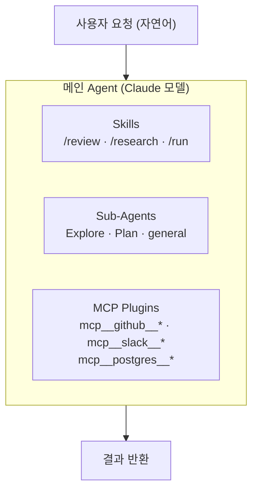
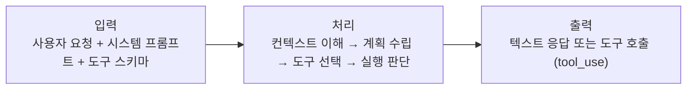
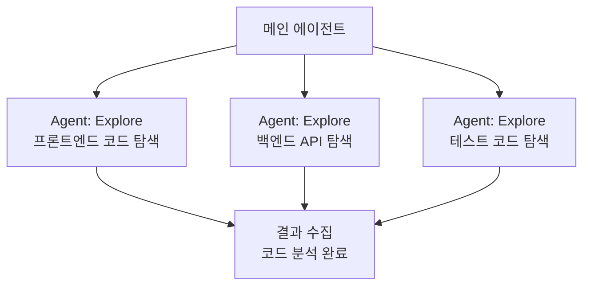
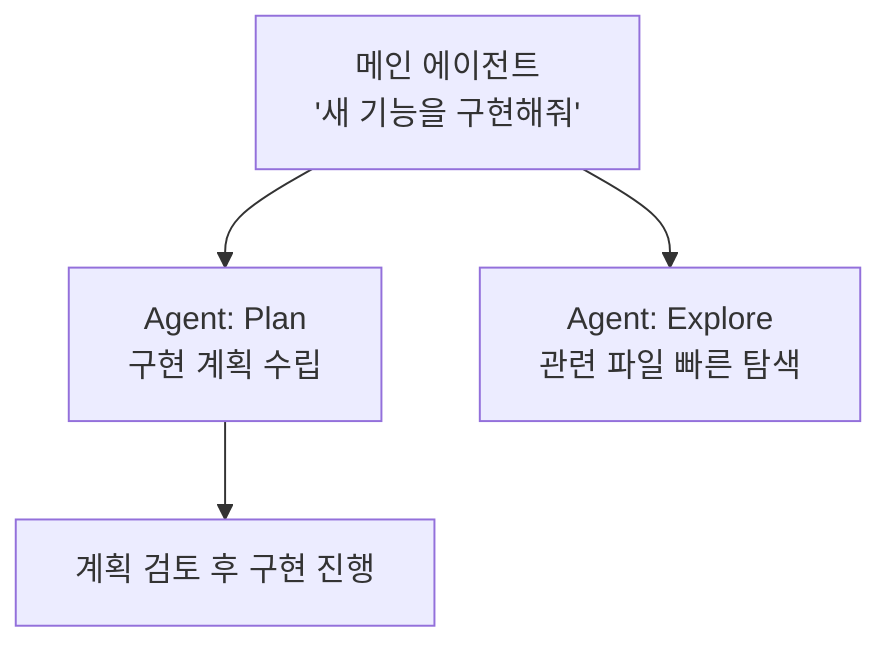
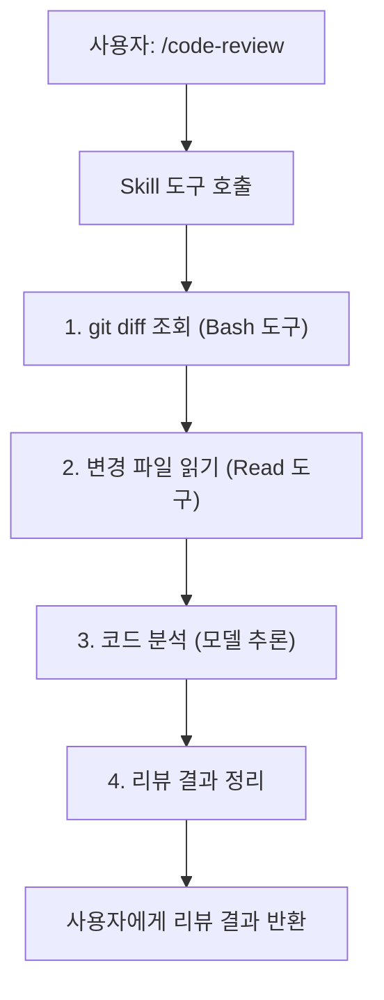
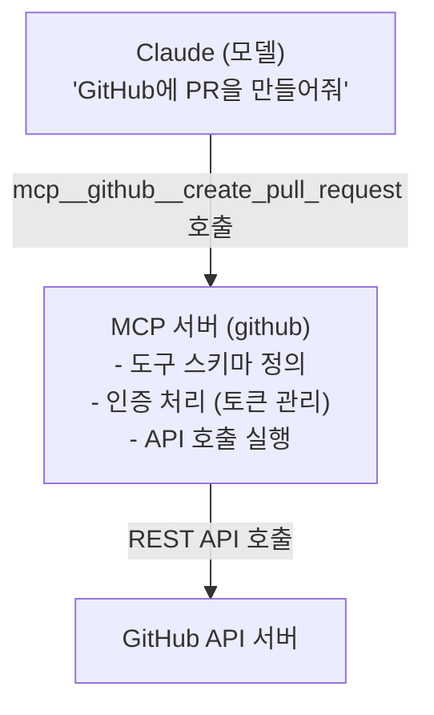
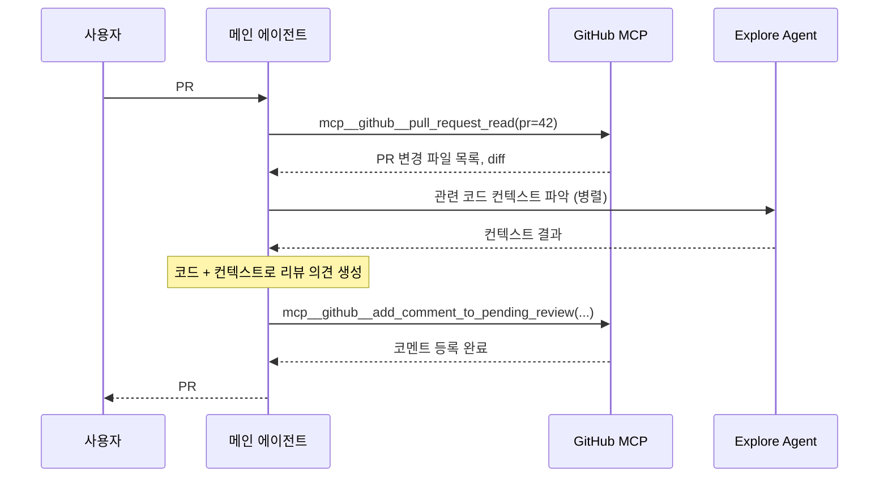
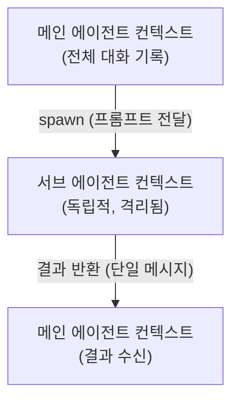
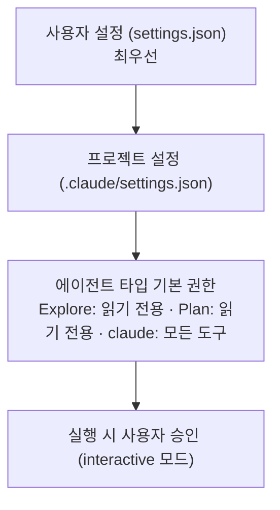
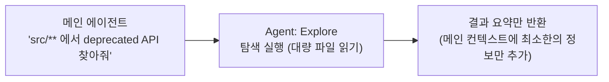

Claude Code에서 Agent를 사용할 때 내부적으로 **모델(Model)**, **스킬(Skill)**, **플러그인(Plugin/MCP)** 세 계층이 유기적으로 동작합니다.  
이 글에서는 각 계층이 무엇인지, 어떻게 연동되는지를 구조적으로 정리합니다.

---

## 전체 구조 한눈에 보기



세 계층의 역할을 간단히 정리하면:

| 계층 | 역할 | 예시 |
|---|---|---|
| **모델 (Model)** | 추론·판단·코드 생성 | Claude Sonnet, Opus, Haiku |
| **스킬 (Skill)** | 재사용 가능한 작업 흐름 | `/code-review`, `/deep-research` |
| **플러그인 (MCP)** | 외부 서비스 연결 | GitHub, DB, 웹 검색 |

---

## 1. 모델 (Model) 계층

모델은 전체 구조의 **두뇌**입니다. 사용자의 자연어 요청을 이해하고, 어떤 도구(Tool)를 어떤 순서로 사용할지 결정합니다.

### 모델 선택 기준

Claude Code는 작업 성격에 따라 다른 모델을 선택할 수 있습니다.

| 모델 | 특징 | 적합한 작업 |
|---|---|---|
| **Opus 4.8** | 최고 성능, 복잡한 추론 | 대규모 리팩토링, 아키텍처 설계 |
| **Sonnet 4.6** | 균형잡힌 속도·성능 | 일반 코드 작업, 버그 수정 |
| **Haiku 4.5** | 빠른 응답, 경량 | 간단한 질의, 빠른 수정 |

### 모델이 하는 일



모델은 직접 코드를 실행하거나 파일을 수정하지 않습니다.  
반드시 **도구(Tool) 호출**을 통해서만 환경에 영향을 줍니다.

---

## 2. 에이전트 (Agent) 시스템

### 메인 에이전트

대화를 주도하는 최상위 에이전트입니다. 복잡한 작업을 받으면 직접 처리하거나 **서브 에이전트**에게 위임합니다.

### 서브 에이전트 종류

Claude Code는 `Agent` 도구로 특화된 서브 에이전트를 생성할 수 있습니다.

| 에이전트 타입 | 용도 | 도구 권한 |
|---|---|---|
| `claude` | 범용 작업 처리 | 모든 도구 |
| `Explore` | 코드베이스 탐색·검색 | 읽기 전용 |
| `Plan` | 구현 계획 설계 | 읽기 전용 |
| `general-purpose` | 복잡한 멀티스텝 작업 | 모든 도구 |
| `claude-code-guide` | Claude Code API 관련 질문 | 검색·읽기 |

### 서브 에이전트 활용 패턴

**병렬 처리**: 독립적인 작업을 동시에 실행해 속도를 높입니다.



**전문화 처리**: 특정 작업에 최적화된 에이전트에게 위임합니다.



---

## 3. 스킬 (Skill) 시스템

스킬은 **반복적으로 사용되는 복잡한 작업 흐름**을 패키지화한 것입니다.  
사용자는 `/skill-name` 형태의 슬래시 커맨드로 호출합니다.

### 스킬의 특징

- 내부적으로 여러 도구 호출과 복잡한 프롬프트 체인을 포함
- 일관된 품질의 결과를 보장
- 메인 에이전트가 `Skill` 도구를 통해 실행

### 주요 스킬 목록

| 스킬 | 호출 방법 | 설명 |
|---|---|---|
| **deep-research** | `/deep-research` | 웹 검색·출처 검증·보고서 작성 |
| **code-review** | `/code-review` | 현재 변경 사항 코드 리뷰 |
| **security-review** | `/security-review` | 보안 취약점 검토 |
| **run** | `/run` | 앱 실행 및 동작 확인 |
| **verify** | `/verify` | 변경사항 실제 동작 검증 |
| **init** | `/init` | CLAUDE.md 초기화 |
| **simplify** | `/simplify` | 코드 단순화·리팩토링 |
| **update-config** | `/update-config` | settings.json 설정 변경 |
| **loop** | `/loop` | 주기적 반복 작업 설정 |

### 스킬 실행 흐름



---

## 4. 플러그인 (MCP) 시스템

### MCP란?

**Model Context Protocol**의 약자로, AI 모델이 외부 서비스와 통신하기 위한 표준 프로토콜입니다.  
Claude Code에서 플러그인은 `mcp__서버명__기능명` 형태의 도구로 노출됩니다.

```bash
# MCP 도구 이름 규칙
mcp__{서버명}__{기능명}

# 예시
mcp__github__create_pull_request
mcp__github__get_file_contents
mcp__slack__send_message
mcp__postgres__query
```

### MCP 서버 구조



### 주요 MCP 플러그인

**개발 협업**

| 플러그인 | 제공 도구 예시 |
|---|---|
| `github` | PR 생성·조회, 이슈 관리, 코드 검색, 브랜치 조작 |
| `gitlab` | MR 생성, 파이프라인 트리거 |
| `jira` | 이슈 생성·업데이트 |

**데이터베이스**

| 플러그인 | 제공 도구 예시 |
|---|---|
| `postgres` | SQL 쿼리 실행, 스키마 조회 |
| `sqlite` | 로컬 DB 읽기·쓰기 |
| `mysql` | 테이블 조회, 데이터 수정 |

**검색 & 웹**

| 플러그인 | 제공 도구 예시 |
|---|---|
| `brave-search` | 웹 검색 |
| `fetch` | URL 콘텐츠 가져오기 |
| `puppeteer` | 브라우저 자동화, 스크린샷 |

---

## 5. 세 계층의 연동: 실제 동작 예시

"이 PR의 코드를 리뷰하고 GitHub에 코멘트를 달아줘" 라는 요청을 처리하는 흐름입니다.



---

## 6. 컨텍스트 격리와 권한 모델

### 서브 에이전트 격리

서브 에이전트는 **독립된 컨텍스트**에서 실행됩니다. 메인 에이전트의 전체 대화 기록을 보지 못하므로, 프롬프트에 필요한 모든 정보를 명시적으로 전달해야 합니다.



### 도구 권한 계층



---

## 7. 성능 최적화 패턴

### 병렬 에이전트 실행

독립적인 탐색 작업은 동시에 실행해 전체 시간을 줄입니다.

```python
# 순차 실행: 30초
Explore("frontend 코드")  # 10초
Explore("backend 코드")   # 10초  
Explore("tests 코드")     # 10초

# 병렬 실행: 10초
동시에 세 Explore 에이전트 실행  # 10초
```

### 컨텍스트 보호

대용량 파일 탐색이나 반복 검색은 서브 에이전트에게 위임해 메인 컨텍스트 창을 보호합니다.



---

## 정리

| 구성요소 | 핵심 역할 | 언제 사용하는가 |
|---|---|---|
| **모델** | 이해·추론·생성 | 항상 (모든 동작의 기반) |
| **서브 에이전트** | 병렬 처리·컨텍스트 격리 | 독립적인 작업을 병렬로 실행할 때 |
| **스킬** | 반복 워크플로우 패키지 | 표준화된 복잡한 작업 |
| **MCP 플러그인** | 외부 서비스 연결 | GitHub·DB·웹 등 외부 시스템 조작 |

Claude Code의 힘은 이 네 가지가 **단일 대화 루프 안에서 유연하게 조합**되는 데 있습니다.  
모델이 판단하고, 에이전트가 병렬로 실행하며, 스킬이 복잡한 흐름을 캡슐화하고, MCP가 외부 세계와 연결합니다.

---

더 궁금한 점은 [GitHub](https://github.com/taengkim)에서 이슈로 남겨주세요!
