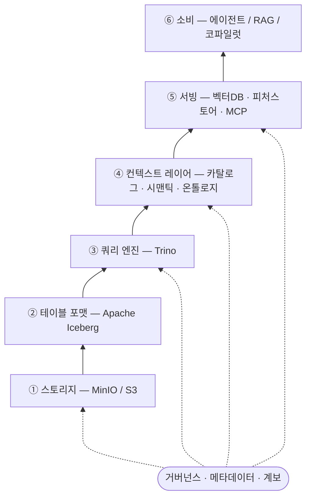
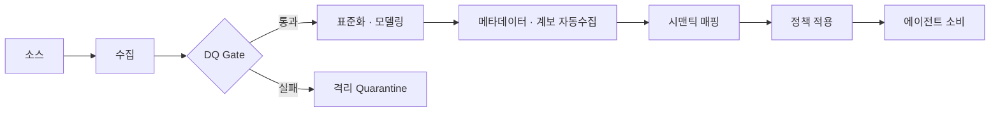

> **TL;DR** BI-Ready는 사람이 해석하는 데이터, AI-Ready는 기계가 추론하는 데이터다. 핵심 차이는 시맨틱 정의·계보·거버넌스가 데이터 안에 내장되는지 여부. Gartner는 AI-Ready 기반 없는 AI 프로젝트의 60%가 2026년까지 폐기된다고 전망한다.
{: .prompt-info }

> 이 데이터를 Claude Code 에이전트가 어떻게 소비하는지 → [Agent 모델·스킬·플러그인 구조 이해하기](/posts/agent-model-skill-plugin-structure/)
{: .prompt-tip }

---

## 1. 개념

### 1.1 한 줄 정의

**AI-Ready Data는 "사람이 해석하도록 만든 데이터"가 아니라 "기계(모델·에이전트)가 추론하도록 만든 데이터"다.**

기존 BI는 의미 해석과 판단을 **분석가가** 덧붙였다. "EMEA 매출"을 보면 사람은 어떤 국가가 EMEA인지, 어떤 통화로 환산할지, 어떤 매출 정의(인식 시점/환불 차감 여부)를 쓸지를 맥락으로 안다. 반면 LLM 에이전트는 그 판단 근거가 **데이터와 메타데이터에 명시적으로 내장돼 있지 않으면** 추측하거나 환각한다.

AI-Ready Data는 다음을 만족하는 데이터다:

- **발견 가능(discoverable)** 하고 **실시간 접근 가능(accessible)**
- 단일 ID·정책 모델로 **거버넌스**되며
- **고품질**이고
- 시스템 간 복사·이동 없이 **에이전트·코파일럿이 소비할 수 있는 재사용 가능한 데이터 프로덕트**로 제공된다

### 1.2 BI-Ready ≠ AI-Ready

BI 성숙도가 높은 조직이 AI 파일럿에서 줄줄이 실패하는 패턴이 2026년 내내 관찰됐다. 대시보드는 잘 돌아가는데, 에이전트는 지표를 환각하거나 지역 필터를 잘못 적용하거나 출처를 추적할 수 없는 숫자를 내놓는다. 원인은 모델이나 프롬프트가 아니라, **데이터가 사람이 해석하도록 만들어졌기 때문**이다.

| 구분 | BI-Ready | AI-Ready |
|---|---|---|
| 소비 주체 | 분석가(사람) | 모델·에이전트(기계) |
| 맥락의 위치 | 분석가의 머릿속/문서 | 데이터·메타데이터에 명시적으로 내장 |
| 의미 정의 | 암묵적, 화면 옆 주석 | 기계 판독 가능(machine-readable) 시맨틱 |
| 신뢰 근거 | "대시보드가 맞겠지" | 추적 가능한 계보·출처 |
| 실패 양상 | 잘못된 차트 | 환각, 추적 불가, 정책 위반 |

### 1.3 왜 지금

- Gartner: 2026년까지 **AI-Ready Data 기반 없는 AI 프로젝트의 60%가 폐기**
- Cloudera/HBR 2026.3 조사(IT 리더 1,574명): **데이터가 AI에 완전히 준비됐다는 조직 7%**
- 2026 Gartner D&A Summit: **"컨텍스트"를 엔터프라이즈 AI의 핵심 인프라**로 규정, **"데이터 영양성분표(data nutrition label)"** 개념 주목

---

## 2. 구성요소

### 2.1 품질 (Quality)

오류·중복·결측이 정제·검증된 상태. 단발성 클렌징이 아니라 **DQ 룰 + 데이터 관측성(observability)** 으로 지속 감시한다.  
핵심 지표: completeness, uniqueness, validity, freshness, 스키마 드리프트 탐지.

### 2.2 구조·표준화 (Structure)

모델이 일관되게 처리할 수 있는 표준 포맷·스키마·타입·단위. 통화·시간대·코드 체계가 소스마다 다르면 에이전트가 합칠 수 없다.

### 2.3 메타데이터·시맨틱 (Context)

가장 결정적인 축. 컬럼·테이블의 **비즈니스 의미, 정의, 단위, 허용값**을 기계 판독 가능하게 기술한다.  
**시맨틱 레이어(메트릭 정의)** 와 **온톨로지/지식그래프**가 여기에 해당한다.

### 2.4 계보·설명가능성 (Lineage & Explainability)

데이터가 어디서 와서 어떻게 변형됐는지(provenance). 에이전트가 답의 근거를 **어느 스냅샷·어느 소스로 역추적**할 수 있어야 EU AI Act 등 규제 대응이 가능하다.

### 2.5 거버넌스·접근제어 (Governance)

단일 identity·policy 모델. row-level / column-level 보안, PII 마스킹, 감사 로그.  
AI 거버넌스와 데이터 거버넌스가 **같은 메타데이터 기반**에서 일관되게 적용.

### 2.6 발견 가능성·접근성 (Discoverability & Accessibility)

데이터 카탈로그로 자산을 찾을 수 있고, 복사·이동 없이 실시간으로 질의·소비 가능. **데이터 프로덕트**로 패키징해 재사용성을 높인다.

### 2.7 AI 전용 가공 (AI-Specific Provisioning)

정형 데이터: 시맨틱·SQL 경로. 비정형 데이터: **벡터 스토어, 청킹(chunking), 임베딩(embedding), RAG 연동, 피처 스토어**.

---

## 3. 동작 방식

### 3.1 레이어드 아키텍처

거버넌스·메타데이터·계보는 모든 레이어를 관통하는 횡단 관심사다.



### 3.2 데이터 흐름



핵심: **"맥락과 신뢰가 데이터와 함께 흐른다."** 에이전트가 받는 것은 raw 테이블이 아니라, 의미가 붙고 정책이 적용되고 출처가 추적되는 데이터 프로덕트다.

---

## 4. 실제 구동 예

### 예 1 — "지난달 EMEA 톱 제품?" (Iceberg/Trino/Airflow 스택)

#### (1) Iceberg 테이블 정의

```sql
CREATE TABLE lakehouse.sales.orders (
  order_id   BIGINT        NOT NULL COMMENT '주문 고유 식별자',
  product_id BIGINT        NOT NULL COMMENT 'products.catalog FK',
  region     VARCHAR(50)   NOT NULL COMMENT 'EMEA | APAC | AMER',
  currency   CHAR(3)       NOT NULL COMMENT 'ISO 4217 통화 코드',
  gross_amt  DECIMAL(18,2) NOT NULL COMMENT '세전 총 금액 (USD 환산)',
  refund_amt DECIMAL(18,2)          COMMENT '환불 금액 (없으면 NULL)',
  created_at TIMESTAMP     NOT NULL COMMENT '주문 생성 시각 (UTC)'
)
USING iceberg
PARTITIONED BY (days(created_at), bucket(16, product_id))
TBLPROPERTIES (
  'history.expire.min-snapshots-to-keep' = '10'
);
```

컬럼 `COMMENT`가 메타데이터의 시작이다. 에이전트는 이 정의로 `gross_amt`가 USD 환산임을, `refund_amt`가 nullable임을 알 수 있다.

#### (2) DQ 게이트 — Airflow + Great Expectations

```python
@task
def run_dq_gate(snapshot_id: str) -> None:
    from great_expectations.data_context import get_context
    ctx = get_context()
    result = ctx.run_checkpoint(
        checkpoint_name="orders_checkpoint",
        batch_request={"snapshot_id": snapshot_id},
    )
    if not result.success:
        # 실패 시 다운스트림 publish DAG 차단
        raise AirflowException(f"DQ 실패: {result.statistics}")
```

검증을 통과한 스냅샷만 에이전트에게 노출된다.

#### (3) 시맨틱 레이어 (dbt Metrics)

```yaml
metrics:
  - name: net_revenue
    label: 순매출
    model: ref('orders')
    description: >
      gross_amt에서 refund_amt를 차감한 실제 인식 매출.
      통화는 USD 기준으로 환산됨 (환율: fx_rates 테이블).
    calculation_method: sum
    expression: "gross_amt - COALESCE(refund_amt, 0)"
    timestamp: created_at
    dimensions: [region, currency, product_id]
```

에이전트가 "순매출"을 물으면 이 정의를 참조해 SQL을 생성한다. 추측이 없다.

#### (4) 온톨로지 매핑 — morph-kgc RML

```yaml
prefixes:
  ex:  "http://example.org/ontology/"
  xsd: "http://www.w3.org/2001/XMLSchema#"

mappings:
  OrderMap:
    sources: [["trino:lakehouse.sales.orders", sql]]
    subject: ex:Order/$(order_id)
    predicateobjects:
      - [a,             ex:Order]
      - [ex:hasRegion,  ex:Region/$(region)]
      - [ex:hasProduct, ex:Product/$(product_id)]
      - [ex:netRevenue, "$(gross_amt)", xsd:decimal]
```

Jena Fuseki로 서빙되면 에이전트는 SPARQL로 `Region`·`Product` 관계를 해소할 수 있다.

#### (5) 에이전트 질의 → Trino 실행

```sql
-- 에이전트가 시맨틱 정의를 참조해 생성한 SQL
SELECT p.product_name,
       SUM(o.gross_amt - COALESCE(o.refund_amt, 0)) AS net_revenue
FROM   lakehouse.sales.orders o
JOIN   lakehouse.products.catalog p ON o.product_id = p.product_id
WHERE  o.region IN (
         SELECT country_code
         FROM   governance.region_definitions
         WHERE  region_name = 'EMEA'   -- 시맨틱 레이어의 EMEA 정의
       )
  AND  o.created_at >= date_trunc('month', current_date - INTERVAL '1' MONTH)
  AND  o.created_at <  date_trunc('month', current_date)
GROUP  BY p.product_name
ORDER  BY net_revenue DESC
LIMIT  10;
```

응답에는 **사용한 Iceberg 스냅샷 ID · 메트릭 정의 · KG 엔티티**가 계보로 첨부된다.

> **AI-Ready가 아닐 때:** "EMEA" 범위를 모델이 추측, net/gross 혼동, 잘못된 통화 합산, 출처 추적 불가 → 그럴듯하지만 틀린 답(환각).
{: .prompt-warning }

### 예 2 — 사내 문서 RAG 파이프라인 (비정형)

```python
# 1. 수집 → 2. 청킹 → 3. 임베딩 → 4. 메타데이터 인덱싱
from langchain.text_splitter import RecursiveCharacterTextSplitter
from langchain.embeddings import OpenAIEmbeddings
from langchain.vectorstores import Chroma

splitter = RecursiveCharacterTextSplitter(chunk_size=512, chunk_overlap=64)

for doc in fetch_internal_docs():
    chunks = splitter.split_text(doc["content"])
    metadatas = [
        {
            "source_url": doc["url"],
            "updated_at": doc["updated_at"],
            "department": doc["department"],
            "access_level": doc["access_level"],  # 권한 필터링용
        }
        for _ in chunks
    ]
    vectorstore.add_texts(chunks, metadatas=metadatas)

# 5. 권한 필터링 검색
def search_with_auth(query: str, user_access_level: int):
    return vectorstore.similarity_search(
        query,
        filter={"access_level": {"$lte": user_access_level}},
    )
```

벡터만 넣으면 "검색은 되지만 신뢰·거버넌스가 빠진" 상태다.  
**출처·권한·신선도 메타데이터가 벡터와 함께 흘러야** AI-Ready다.

---

## 5. 구축 로드맵

AI-Ready Data는 한 번에 완성되지 않는다. 단계별로 접근하는 것이 현실적이다.


| 단계 | 목표 | 주요 작업 |
|---|---|---|
| **1단계** | 데이터 신뢰 확보 | 핵심 테이블 DQ 룰 정의, 스키마 문서화, 카탈로그 등록 |
| **2단계** | 시맨틱 레이어 구축 | 핵심 메트릭 dbt 정의, 비즈니스 용어집 작성 |
| **3단계** | 계보·거버넌스 자동화 | 파이프라인 계보 캡처, row/column 정책 적용, PII 마스킹 |
| **4단계** | AI 전용 가공 | 벡터 스토어 구축, 임베딩 파이프라인, 온톨로지 매핑 |
| **5단계** | 에이전트 연동 | MCP/SQL 도구 노출, RAG 통합, 응답에 계보 첨부 |

> 1단계 없이 4·5단계를 시작하면 고품질 환각을 만든다.
{: .prompt-warning }

---

## 6. 빠른 진단 체크리스트

- [ ] 에이전트가 핵심 지표의 **정의를 추측 없이** 데이터에서 가져올 수 있는가
- [ ] 답변의 숫자를 **소스·스냅샷까지 역추적**할 수 있는가
- [ ] 품질 검증을 통과 못 한 데이터가 **자동으로 차단·격리**되는가
- [ ] row/column 보안·PII 마스킹이 **질의 시점에 강제**되는가
- [ ] "EMEA", "활성 고객" 같은 비즈니스 개념이 **기계 판독 가능 시맨틱**으로 정의돼 있는가
- [ ] 정형(SQL/시맨틱)과 비정형(임베딩/RAG) 경로가 **둘 다 거버넌스 안에** 있는가
- [ ] 데이터가 **복사·이동 없이** 재사용 가능한 프로덕트로 제공되는가

> 세 개 이상 비어 있으면, 모델·프롬프트가 아니라 데이터 readiness부터 손봐야 할 신호다.
{: .prompt-danger }

---

## 참고 출처

- Gartner, "Lack of AI-Ready Data Puts AI Projects at Risk" (2025); "AI-Ready Data Essentials to Capture AI Value" (2025); "Follow These Five Steps to Make Sure Your Data Is AI-Ready" (2024)
- Gartner Data & Analytics Summit 2026 — 컨텍스트 엔지니어링·시맨틱 레이어/지식그래프 권고
- Cloudera & HBR Analytic Services, 엔터프라이즈 IT 리더 1,574명 조사 (2026.3)
- "BI-Ready Is Not AI-Ready", metadataweekly.substack.com (2026.3)
- Alteryx, Atlan, nx1.io — AI-Ready Data 정의·구성요소 정리 (2026)

---

> 이 데이터를 소비하는 에이전트 구조가 궁금하다면 → [Claude Code Agent 모델·스킬·플러그인 구조 이해하기](/posts/agent-model-skill-plugin-structure/)
{: .prompt-tip }
