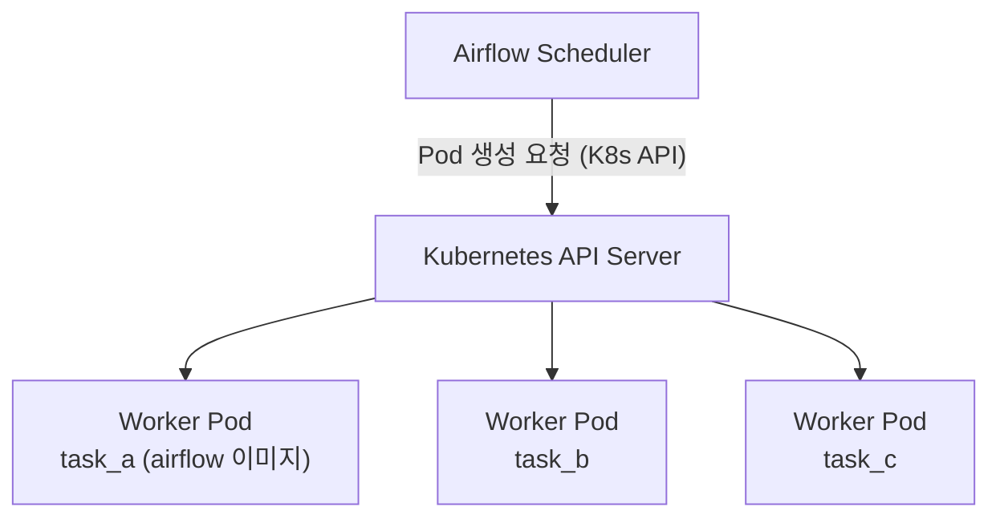
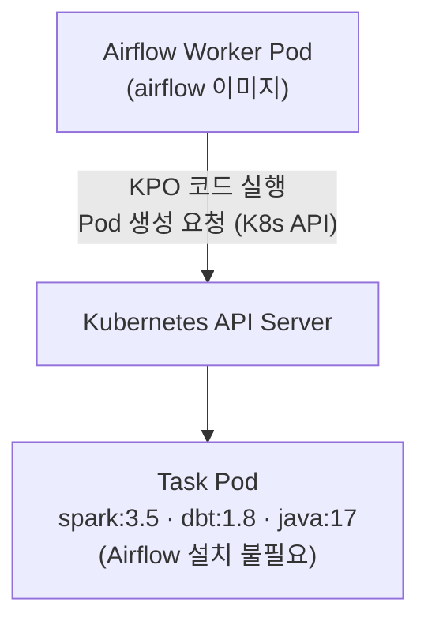
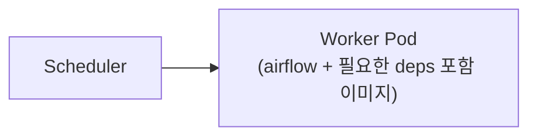
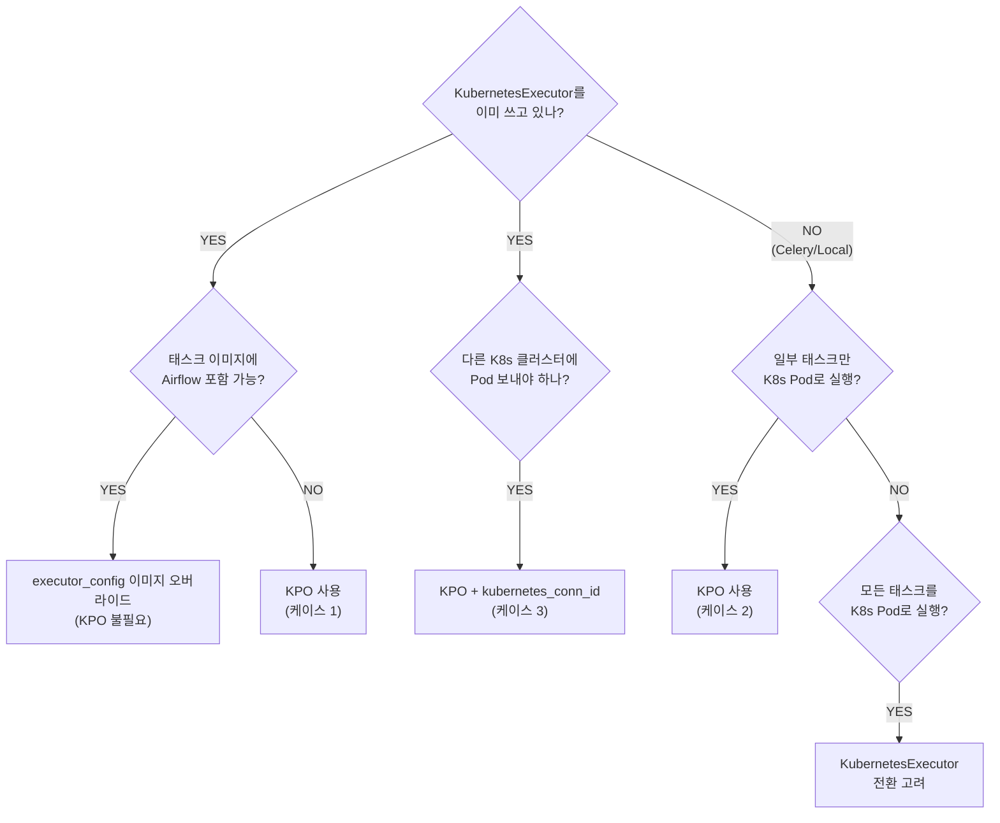

> **TL;DR** — `KubernetesExecutor`를 이미 쓰고 있다면 대부분의 경우 `KubernetesPodOperator`(KPO)는 필요하지 않습니다. `executor_config`로 이미지·리소스·GPU를 태스크별로 제어할 수 있기 때문입니다. KPO가 진짜 필요한 경우는 좁습니다: **이미지에 Airflow를 설치할 수 없거나**, **KubernetesExecutor를 쓰지 않는 환경**에서 일부 태스크만 K8s Pod로 실행해야 할 때입니다.

---

## 1. 한 줄 정의

| | 한 줄 정의 |
|---|---|
| **KubernetesExecutor** | 스케줄러가 **모든 태스크**를 K8s Pod로 실행하는 실행 엔진 |
| **KubernetesPodOperator** | **특정 태스크 하나**가 외부 K8s Pod를 직접 생성·감시하는 오퍼레이터 |
| **멀티 익스큐터 (3.x)** | 하나의 클러스터에서 복수의 익스큐터를 등록하고 태스크별로 선택 |

---

## 2. 작동 방식 비교

### KubernetesExecutor

스케줄러가 태스크마다 K8s Pod를 직접 생성합니다. Pod 이미지는 Airflow Worker 이미지가 기본이며, `executor_config`로 태스크별 오버라이드가 가능합니다.



**중요**: 오버라이드된 이미지에도 **Airflow(Task SDK)가 설치돼 있어야** 합니다. 스케줄러가 띄운 Pod 안에서 `airflow tasks run` 명령이 실행되기 때문입니다.

### KubernetesPodOperator

이미 실행 중인 Worker(또는 스케줄러) 안의 KPO 코드가 K8s API를 호출해 **별도 Pod**를 생성합니다.



KubernetesExecutor 환경에서 KPO를 쓰면 **Pod이 Pod를 생성하는 구조**가 됩니다. Pod 2개 분의 기동 시간과 리소스가 필요합니다.

---

## 3. KubernetesExecutor + executor_config로 충분한 경우

**KubernetesExecutor를 쓰고 있다면, 아래 요구사항은 KPO 없이 `executor_config`로 해결됩니다.**

### 태스크별 이미지 오버라이드

```python
@task(
    executor_config={
        "KubernetesExecutor": {
            "image": "my-registry/custom-airflow:ml-deps",
            # 이 이미지에도 Airflow가 설치돼 있어야 함
        }
    }
)
def train():
    import torch
    ...
```

### 태스크별 리소스·GPU 제어

```python
@task(
    executor_config={
        "KubernetesExecutor": {
            "image": "my-registry/airflow-gpu:3.2",
            "resources": {
                "requests": {"memory": "8Gi", "cpu": "4", "nvidia.com/gpu": "1"},
                "limits":   {"memory": "16Gi", "cpu": "8", "nvidia.com/gpu": "1"},
            },
            "tolerations": [
                {"key": "nvidia.com/gpu", "operator": "Exists", "effect": "NoSchedule"}
            ],
            "node_selector": {"cloud.google.com/gke-accelerator": "nvidia-tesla-t4"},
        }
    }
)
def heavy_ml_task():
    ...
```

### 태스크별 환경변수·볼륨

```python
@task(
    executor_config={
        "KubernetesExecutor": {
            "env_vars": [{"name": "DB_PASSWORD", "valueFrom": {"secretKeyRef": {"name": "db-secret", "key": "password"}}}],
            "volumes": [{"name": "data", "persistentVolumeClaim": {"claimName": "data-pvc"}}],
            "volume_mounts": [{"name": "data", "mountPath": "/data"}],
        }
    }
)
def process():
    ...
```

**이 정도면 충분합니다.** 같은 K8s 클러스터 안에서 KPO를 추가로 쓸 이유가 없습니다.

---

## 4. KPO가 진짜 필요한 3가지 경우

### 케이스 1: 이미지에 Airflow를 설치할 수 없거나 설치하기 싫을 때

KubernetesExecutor의 이미지 오버라이드는 이미지 안에 Airflow가 있어야 동작합니다. 다음 상황이면 KPO가 필요합니다.

- **순수 런타임 이미지** 그대로 쓰고 싶은 경우: `apache/spark:3.5`, `ghcr.io/dbt-labs/dbt-bigquery:1.8`, 사내 레거시 Java 이미지 등에 Airflow를 추가하는 게 불가하거나 이미지 관리 정책상 허용되지 않을 때
- 이미지 크기를 최소화해야 하는 경우

```python
from airflow.providers.cncf.kubernetes.operators.pod import KubernetesPodOperator

run_dbt = KubernetesPodOperator(
    task_id="run_dbt",
    image="ghcr.io/dbt-labs/dbt-bigquery:1.8.0",  # Airflow 없음
    cmds=["dbt", "run"],
    arguments=["--project-dir", "/dbt"],
    namespace="airflow",
    deferrable=True,   # Airflow 3.x 권장
    get_logs=True,
    is_delete_operator_pod=True,
)
```

### 케이스 2: KubernetesExecutor를 쓰지 않는 환경에서 일부 태스크만 K8s Pod로 실행

CeleryExecutor 또는 LocalExecutor 환경에서 특정 태스크만 K8s Pod로 실행해야 할 때입니다.

```
CeleryExecutor 환경:
    Celery Worker ──▶ 일반 태스크 실행
    Celery Worker ──▶ KPO 코드 실행 → [K8s Task Pod]
```

### 케이스 3: 다른 K8s 클러스터에 Pod를 띄워야 할 때

Airflow가 뜬 클러스터가 아닌 별도 클러스터(예: 운영 데이터 클러스터, 온프레미스 GPU 클러스터)에 워크로드를 보내야 할 때, `kubernetes_conn_id`로 다른 클러스터를 지정할 수 있습니다.

```python
KubernetesPodOperator(
    task_id="run_on_gpu_cluster",
    kubernetes_conn_id="gpu_cluster_conn",  # 별도 클러스터 연결
    image="my-ml-image:latest",
    ...
)
```

---

## 5. Airflow 3.x 멀티 익스큐터

Airflow 3.0부터 하나의 클러스터에서 복수의 익스큐터를 동시에 운영하고 태스크별로 선택할 수 있습니다. 이 기능이 있으면 `CeleryKubernetesExecutor`(Airflow 2.x 방식)보다 훨씬 명시적으로 제어할 수 있습니다.

```ini
# airflow.cfg
[core]
executor = CeleryExecutor,KubernetesExecutor
# 첫 번째가 기본값 — executor 파라미터 생략 시 CeleryExecutor로 실행
```

```python
@dag(schedule="0 2 * * *", start_date=pendulum.datetime(2026, 1, 1, tz="UTC"), catchup=False)
def pipeline():

    @task(executor="CeleryExecutor")          # 빠른 기동, 경량 작업
    def extract(): ...

    @task(executor="CeleryExecutor")
    def transform(): ...

    @task(
        executor="KubernetesExecutor",        # 격리 필요, 무거운 작업
        executor_config={
            "KubernetesExecutor": {
                "image": "my-registry/airflow-gpu:3.2",  # Airflow 포함
                "resources": {"requests": {"nvidia.com/gpu": "1"}},
            }
        },
    )
    def train(): ...

    extract() >> transform() >> train()
```

KPO 없이 이 구조만으로 경량/중량 태스크를 깔끔하게 분리할 수 있습니다.

---

## 6. 조합 패턴과 안티패턴

### 권장: CeleryExecutor + KPO (케이스 2)


Airflow 자체는 Celery로 운영하면서, Airflow를 설치할 수 없는 순수 런타임 이미지만 K8s Pod로 분리할 때 유효합니다.

### 권장: KubernetesExecutor + executor_config (케이스 없음)



KPO 없이 executor_config 이미지 오버라이드로 대부분 해결합니다.

### 주의: KubernetesExecutor + KPO


이미지에 Airflow를 설치할 수 없는 경우(케이스 1)에만 정당화됩니다. 그 외에는 Pod 2중 기동 오버헤드만 추가됩니다.

---

## 7. 함정 / 흔한 혼동

### "KPO를 쓰면 어떤 이미지든 쓸 수 있으니 KubernetesExecutor + KPO가 최선이다"

오해입니다. KubernetesExecutor 환경에서 이미지에 Airflow를 포함시킬 수 있다면 `executor_config`로 충분합니다. KPO는 Airflow를 넣을 수 없을 때의 탈출구이지, 기본 선택지가 아닙니다.

### "KPO를 쓰려면 KubernetesExecutor가 필요하다"

반대입니다. KPO는 Executor와 무관합니다. LocalExecutor나 CeleryExecutor 위에서도 KPO는 동작합니다. KPO가 K8s API에 접근할 수만 있으면 됩니다.

### executor_config 이미지 오버라이드 후 태스크 실패

오버라이드 이미지에 Airflow가 없으면 `airflow tasks run` 실행이 불가해 Pod가 즉시 실패합니다. "이미지에 Airflow 없음 → KPO 사용"이 올바른 판단 흐름입니다.

### KPO 로그 소실

`is_delete_operator_pod=True`(기본값) 환경에서 `get_logs=True` 없이 원격 로그 스토리지를 미설정하면 실패한 태스크의 로그가 Pod 삭제와 함께 사라집니다.

---

## 8. 의사결정 플로우



---

## 마무리

**KubernetesExecutor를 이미 운영 중이라면, KPO는 마지막 수단입니다.**

- 이미지에 Airflow를 포함시킬 수 있다 → `executor_config`로 해결
- GPU, 특수 리소스, 노드 셀렉터 → `executor_config`로 해결
- Airflow 3.x 멀티 익스큐터 → `executor` 파라미터로 해결

KPO를 추가하면 Pod-in-Pod 구조가 만들어지고, 기동 지연·리소스 낭비·로그 설정 부담이 따릅니다. "이미지에 Airflow를 넣을 수 없다"는 조건이 충족될 때만 KPO를 선택하세요.

---

더 궁금한 점은 [GitHub](https://github.com/taengkim)에서 이슈로 남겨주세요!
