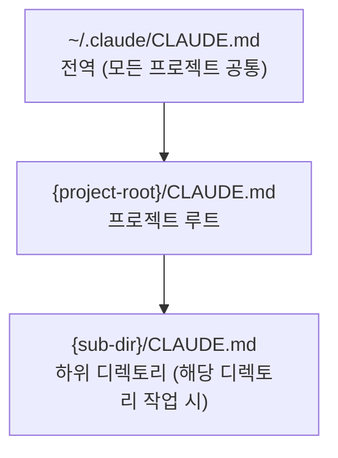

> **TL;DR** — `CLAUDE.md`는 Claude Code가 프로젝트에 진입할 때 가장 먼저 읽는 파일입니다. "무엇을 할 수 있나"를 나열하는 게 아니라 **"이 프로젝트에서 Claude가 모르면 안 되는 것"**을 적는 곳입니다. 잘 쓴 `CLAUDE.md` 하나가 매 세션마다 반복하는 컨텍스트 설명을 없애줍니다.

---

## 1. CLAUDE.md가 하는 일

Claude Code는 세션을 시작할 때 다음 순서로 `CLAUDE.md`를 탐색합니다.



이 파일의 내용은 **시스템 프롬프트에 자동으로 주입**됩니다. 사용자가 매번 설명하지 않아도 Claude가 프로젝트 구조, 규칙, 주의사항을 알고 시작합니다.

`CLAUDE.md`가 없으면 Claude는 매 세션마다 코드베이스를 처음부터 탐색하거나, 사용자에게 반복적으로 물어봐야 합니다.

---

## 2. 무엇을 적어야 하는가

### 적어야 하는 것

**프로젝트 맥락** — Claude가 코드만 봐서는 알 수 없는 배경 정보.

```markdown
## 프로젝트 개요
Python 3.11 기반 데이터 파이프라인. Airflow 3.x + PostgreSQL 15.
DAG 파일은 `dags/` 하위에만 작성. `src/`는 공유 유틸리티.
```

**금지 사항 / 주의사항** — 실수하면 손상을 일으키는 규칙.

```markdown
## 주의
- `alembic/versions/`의 마이그레이션 파일은 절대 수정하지 말 것. 새 리비전을 생성할 것.
- `config/prod.yaml`은 읽기 전용. 프로덕션 설정 변경은 PR로만.
- DB 직접 DROP/TRUNCATE 금지.
```

**코드 규칙** — 팀 컨벤션 또는 자동화 도구로 강제되지 않는 규칙.

```markdown
## 코드 스타일
- 타입 힌트 필수. `Any` 사용 지양.
- 공개 함수에 docstring 불필요 (이름으로 충분하면 생략).
- 테스트 파일명: `test_{module}.py`. fixture는 `conftest.py`에 모을 것.
```

**자주 쓰는 명령어** — 프로젝트 특화 커맨드.

```markdown
## 개발 명령어
- 테스트: `pytest tests/ -x -q`
- 린트: `ruff check . && mypy src/`
- DB 마이그레이션: `alembic upgrade head`
- 로컬 Airflow 기동: `docker compose up -d`
```

**아키텍처 결정 사항 (ADR)** — "왜 이렇게 짰는가"를 적는 곳.

```markdown
## 설계 결정
- ORM 대신 raw SQL 사용: 복잡한 집계 쿼리가 많아 SQLAlchemy ORM의 N+1이 문제였음.
- Celery 대신 KubernetesExecutor: 태스크별 의존성이 달라 이미지를 분리함.
```

### 적지 말아야 하는 것

- **자명한 내용**: "Python으로 작성됐습니다", "git을 사용합니다" — Claude가 코드를 보면 알 수 있는 것.
- **장황한 설명**: 핵심만. 길수록 중요한 내용이 묻힙니다.
- **최신 상태 유지가 어려운 정보**: 자주 바뀌는 세부 구현은 코드에서 읽는 게 낫습니다.
- **비밀 정보**: API 키, 패스워드. `CLAUDE.md`는 보통 git에 커밋됩니다.

---

## 3. 구조 패턴

### 기본 템플릿

```markdown
# {프로젝트명}

한 줄 설명. 무엇을 하는 프로젝트인가.

## 기술 스택
- 언어/런타임 버전
- 주요 프레임워크
- 인프라 (DB, 큐, 오케스트레이터)

## 디렉토리 구조
중요한 디렉토리와 역할만. 전체 트리 불필요.

## 개발 명령어
자주 쓰는 커맨드.

## 주의 / 금지
실수하면 안 되는 것.

## 코드 규칙
린터·포매터로 강제되지 않는 팀 컨벤션.

## 설계 결정
왜 이렇게 짰는가 (선택적).
```

### 소규모 프로젝트용 (간결 버전)

```markdown
# my-service

FastAPI + PostgreSQL 서비스. Python 3.12.

테스트: `pytest -x`  |  린트: `ruff check .`  |  실행: `uvicorn main:app --reload`

**주의**: `migrations/`는 수정 금지. `alembic revision --autogenerate`로 새 파일 생성.
```

---

## 4. 전역 vs 프로젝트 CLAUDE.md

### 전역 (`~/.claude/CLAUDE.md`)

모든 프로젝트에 공통으로 적용할 개인 선호·규칙.

```markdown
## 내 작업 스타일
- 커밋 메시지는 한국어로.
- 코드 주석은 최소화. 이름으로 설명되면 주석 불필요.
- 작업 전 항상 현재 브랜치 확인.
- 테스트 없이 기능 구현 완료로 보고하지 말 것.

## 절대 하지 말 것
- `git push --force` (명시적 요청 없이)
- `rm -rf` (확인 없이)
- 프로덕션 DB에 직접 쓰기
```

### 프로젝트 (`{root}/CLAUDE.md`)

이 프로젝트에만 해당하는 규칙. 전역 설정을 오버라이드하거나 보완합니다.

### 하위 디렉토리 (`{sub-dir}/CLAUDE.md`)

모노레포나 대형 프로젝트에서 서브 모듈별로 별도 컨텍스트가 필요할 때 씁니다.

```
project/
├── CLAUDE.md          # 전체 프로젝트 개요
├── backend/
│   └── CLAUDE.md      # 백엔드 특화 규칙 (Django 설정, API 컨벤션)
└── data-pipeline/
    └── CLAUDE.md      # Airflow DAG 작성 규칙
```

---

## 5. 실전 작성 팁

### "Claude에게 물어보면서 쓴다"

초안을 빠르게 만드는 가장 쉬운 방법입니다.

```
"이 프로젝트 코드베이스를 탐색하고 CLAUDE.md 초안을 작성해줘.
 테스트 실행 방법, 주요 디렉토리 역할, 주의사항 위주로."
```

Claude Code의 `/init` 명령도 같은 역할을 합니다.

### 금지 사항은 이유와 함께

이유 없는 금지는 Claude가 우선순위를 판단하지 못합니다.

```markdown
# 나쁨
- alembic 파일 수정 금지.

# 좋음
- `alembic/versions/`는 수정 금지. 수정하면 다른 개발자 환경의 마이그레이션이 깨짐.
  새 변경이 필요하면 `alembic revision --autogenerate -m "설명"`으로 새 파일 생성.
```

### 주기적으로 업데이트

프로젝트가 바뀌면 `CLAUDE.md`도 바뀌어야 합니다. PR 머지할 때 관련 내용이 있으면 같이 업데이트하는 습관이 가장 효과적입니다.

### 너무 길면 역효과

컨텍스트 창에 들어가는 내용이 길수록 중요한 지시사항이 희석됩니다. **한 화면에 읽힐 분량**이 이상적입니다. 세부 내용은 `CLAUDE.md`에서 참조 파일을 링크하는 방식으로 분리하세요.

```markdown
## API 설계 규칙
자세한 내용은 `docs/api-conventions.md` 참고.
핵심: 모든 엔드포인트는 `/api/v{n}/` 접두사. 에러 응답은 `{"error": "...", "code": "..."}`.
```

---

## 6. 체크리스트

`CLAUDE.md`를 처음 만들거나 점검할 때:

- [ ] 프로젝트가 무엇인지 한 줄로 설명했는가
- [ ] 테스트·린트·실행 커맨드가 있는가
- [ ] "절대 하지 말 것"이 명시됐는가 (이유 포함)
- [ ] 코드만 봐서는 알 수 없는 팀 규칙이 들어갔는가
- [ ] 비밀 정보(키, 패스워드)가 없는가
- [ ] 한 화면에 읽히는 길이인가
- [ ] 전역 `~/.claude/CLAUDE.md`에 개인 공통 규칙이 분리됐는가

---

## 마무리

`CLAUDE.md`의 목적은 "Claude를 길들이는 것"이 아니라 **"이 프로젝트의 맥락을 Claude에게 위임하는 것"**입니다. 매 세션마다 "이 프로젝트는 이런 구조고, 이건 건드리면 안 되고..." 를 반복하고 있다면, 그 내용이 `CLAUDE.md`에 없다는 신호입니다.

---

더 궁금한 점은 [GitHub](https://github.com/taengkim)에서 이슈로 남겨주세요!
