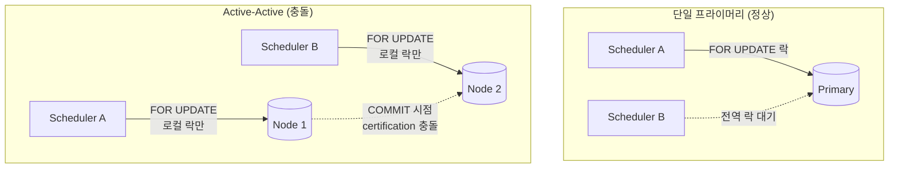
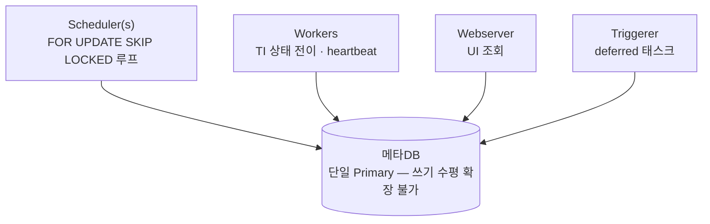
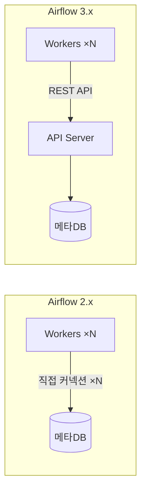
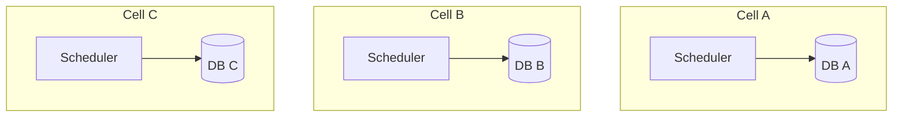
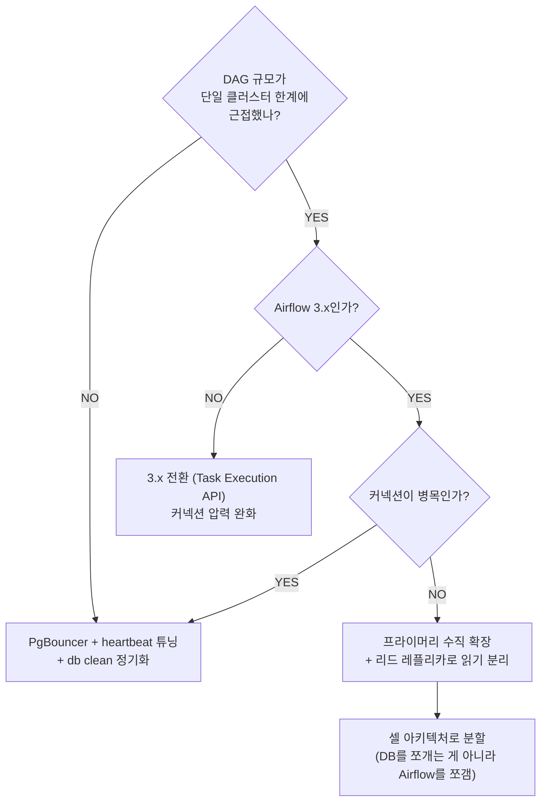

> **TL;DR** — Airflow 스케줄러는 메타DB의 행 락(`SELECT ... FOR UPDATE`)으로 태스크를 조율합니다. 그래서 메타DB를 **Active-Active(멀티 프라이머리)로 이중화하면 락 인증 충돌로 에러**가 납니다. 쓰기를 수평 확장할 수 없다는 이 제약이 대규모 Airflow의 구조적 천장입니다. 해법은 "DB를 쪼개는 것"이 아니라 **부하를 줄이거나(3.x Task Execution API·튜닝) Airflow 자체를 쪼개는 것(셀 아키텍처)**입니다.

---

## 1. 왜 Active-Active가 안 되는가

Airflow 스케줄러는 여러 스케줄러가 같은 DagRun·TaskInstance를 동시에 집지 않도록 **비관적 락(`SELECT ... FOR UPDATE SKIP LOCKED`)**을 겁니다. 이 락이 **전역적으로** 동작해야 조율이 성립합니다.

문제는 Active-Active 멀티 프라이머리 구성(Galera Cluster, MySQL Group Replication 멀티 프라이머리, Postgres BDR 등)이 이 락을 **노드별로 로컬 처리**한다는 점입니다.

- 단일 프라이머리에서는 Scheduler B가 **즉시 대기**하지만,
- Active-Active에서는 두 노드가 각자 **로컬 락만** 잡고 진행하다가 **COMMIT 순간에야** 충돌을 감지합니다.
- Galera는 낙관적 락 + 인증 기반 복제라, 이 충돌이 `Deadlock found` / `WSREP` 에러로 스케줄러에서 터집니다.

Airflow 공식 문서도 못박고 있습니다: **메타DB는 `SELECT ... FOR UPDATE`를 지원해야 하며, Galera·멀티마스터처럼 이를 보장하지 못하는 구성은 지원하지 않는다.**

---

## 2. 올바른 이중화: Active-Passive

메타DB의 HA는 **쓰기 진입점을 항상 1개로 유지**하고, 가용성은 failover로 확보합니다.

| 구성 | Airflow 지원 | 방식 |
|---|---|---|
| Active-Active (멀티 프라이머리) | ❌ | 스케줄러 락 충돌로 에러 |
| **Active-Passive (Primary + Standby)** | ✅ | 쓰기 1대, 장애 시 승격 |
| Postgres: Patroni / RDS Multi-AZ | ✅ | 동기 스탠바이로 HA |
| MySQL: InnoDB Cluster **단일 프라이머리 모드** | ✅ | 멀티 프라이머리 모드는 ❌ |

스케줄러 자체의 이중화는 이미 해결된 문제입니다. Airflow 2.0+의 HA 스케줄러는 **여러 스케줄러가 같은 단일 프라이머리를 바라보며 `FOR UPDATE SKIP LOCKED`로 조율**합니다. 스케줄러는 여러 대 띄우되, 그들이 바라보는 쓰기 DB는 하나입니다.

---

## 3. 그래서 최종 병목은 메타DB다

스케줄러·워커·웹서버·트리거러가 전부 단일 쓰기 프라이머리 하나로 수렴합니다. 쓰기를 분산할 방법이 없으니, DAG가 수천 개로 늘면 병목이 정확히 여기 걸립니다.

부하 요인을 무게 순으로 보면:

1. **스케줄러 루프** — DagRun/TI에 대한 `FOR UPDATE SKIP LOCKED` (가장 무거움)
2. **TI 상태 전이** — 태스크마다 queued → running → success 쓰기
3. **heartbeat** — 워커·스케줄러·잡의 주기적 하트비트
4. **XCom · 로그 메타 · 직렬화 DAG** 읽기·쓰기

---

## 4. 스케일 전략 (효과 순)

### 전략 1: Airflow 3의 Task Execution API (AIP-72) — 가장 근본적

Airflow 3.0부터 **워커가 메타DB에 직접 붙지 않습니다.** API 서버를 경유합니다.

- 2.x: 워커 수 × 커넥션이 DB로 직결 → 커넥션 폭발
- 3.x: 워커는 API 서버만 바라봄 → **DB 커넥션 압력이 크게 감소**

병목을 없애는 건 아니지만(API 서버가 대신 DB를 때림), 커넥션을 **중앙화·완충**해서 대규모에서 숨통을 틔웁니다. 대량 DAG 시스템이라면 3.x 전환 자체가 1순위입니다.

### 전략 2: 셀(Cell) 아키텍처 — 진짜 수평 확장

단일 클러스터로 한계면, **여러 독립 Airflow 배포로 DAG를 분할**합니다. 각 셀이 자기 메타DB를 가집니다.

AA가 안 되니 **DB를 쪼개는 대신 Airflow를 쪼갭니다.** 팀·도메인·우선순위 단위로 DAG를 배분하면 각 셀의 메타DB 부하가 독립적으로 유지됩니다. Airflow 3의 멀티팀(멀티 배포) 방향과도 맞습니다.

### 전략 3: DB 압력 직접 줄이기

- **PgBouncer 커넥션 풀링** — 커넥션 수가 1차 병목이라 사실상 필수
- **heartbeat 간격 조정** — `scheduler_heartbeat_sec`, `job_heartbeat_sec`을 늘려 쓰기 빈도 감소
- **`db clean` 정기 실행** — `task_instance`·`log`·`xcom` 대형 테이블을 비워 쿼리 성능 유지 ([관련 포스트](/posts/airflow-db-clean-dag-version-fk/))
- **웹서버 조회를 리드 레플리카로 분리** — 읽기만 오프로드, 쓰기는 여전히 프라이머리
- **XCom을 외부 백엔드로** — 대용량 XCom을 DB 대신 S3 등으로

### 전략 4: 프라이머리 수직 확장 + 튜닝

결국 쓰기가 1대라 마지막 카드는 스케일업입니다.

- CPU / IOPS / 메모리 증설
- 테이블 파티셔닝, autovacuum 튜닝(Postgres)
- 인덱스 점검

---

## 5. 함정 / 흔한 실수

### "HA니까 Active-Active로 DB를 이중화하자"

가장 흔한 함정입니다. Airflow 메타DB의 HA는 **Active-Passive + failover**이지 멀티 프라이머리가 아닙니다. Galera로 구성하면 평소엔 돌아가는 듯하다가 스케줄러 부하가 오르는 순간 `WSREP` 데드락이 쏟아집니다.

### "스케줄러를 늘리면 처리량이 선형으로 오른다"

스케줄러 HA는 가용성·부분적 처리량 향상엔 유효하지만, **모두 같은 쓰기 DB를 공유**하므로 DB가 포화되면 스케줄러를 더 늘려도 소용없습니다. 오히려 락 경합만 늘 수 있습니다.

### "리드 레플리카를 붙이면 쓰기도 분산된다"

리드 레플리카는 **읽기만** 오프로드합니다. 스케줄러의 `FOR UPDATE`는 쓰기 프라이머리로 가야 하므로 핵심 병목은 그대로입니다.

### "3.x로 올리면 DB 병목이 사라진다"

Task Execution API는 커넥션을 중앙화·완충할 뿐, DB를 없애지 않습니다. API 서버가 대신 DB를 때리므로 궁극적 상한은 여전히 존재합니다. 진짜 수평 확장은 셀 분할입니다.

---

## 6. 의사결정 플로우

---

## 마무리

Airflow의 메타DB는 **의도적으로 단일 쓰기 프라이머리**를 전제로 설계됐습니다. 스케줄러의 락 기반 조율이 그 위에서 성립하기 때문입니다. 그래서 "DB를 Active-Active로 이중화해 쓰기를 분산한다"는 발상은 애초에 아키텍처와 충돌합니다.

대규모를 감당하는 순서는 명확합니다:

1. **부하를 줄인다** — 3.x Task Execution API, 커넥션 풀링, db clean, 튜닝
2. **읽기를 분리한다** — 리드 레플리카로 웹서버 조회 오프로드
3. **수직 확장한다** — 프라이머리 스케일업 (마지막 카드)
4. **그래도 안 되면 쪼갠다** — 셀 아키텍처로 Airflow 자체를 분할

DB를 수평 확장하려 하지 말고, **부하를 줄이거나 Airflow를 쪼개세요.** 그게 이 제약과 싸우지 않고 함께 가는 방식입니다.

---

더 궁금한 점은 [GitHub](https://github.com/taengkim)에서 이슈로 남겨주세요!
