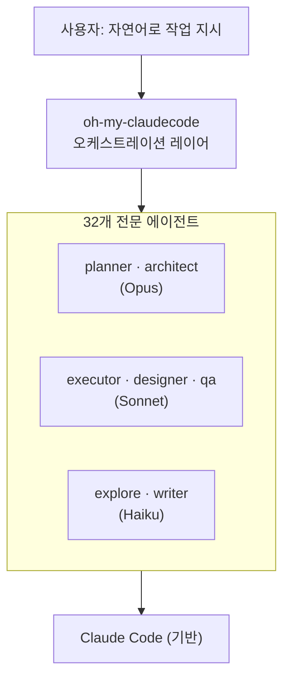
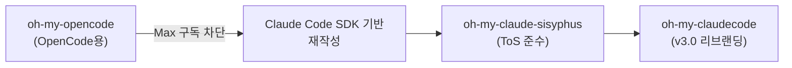
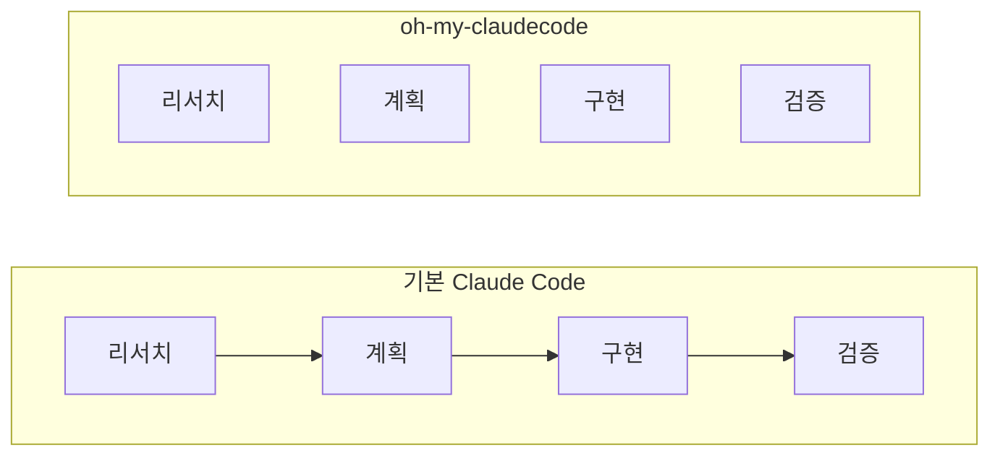

> **TL;DR** — `oh-my-claudecode`(줄여서 OMC)는 Claude Code 위에 얹는 **멀티에이전트 오케스트레이션 플러그인**입니다. 32개의 전문 에이전트와 6개의 실행 모드를 주입해, 단일 에이전트가 순차 처리하던 작업을 여러 에이전트가 병렬로 처리하게 만듭니다. 이름은 `oh-my-zsh`에서 왔지만, 실체는 설정 관리 도구가 아니라 AI 에이전트 팀 프레임워크입니다.

---

## 1. oh-my-claude란

`oh-my-claude`라는 이름으로 여러 프로젝트가 존재하지만, 핵심은 **[Yeachan-Heo/oh-my-claudecode](https://github.com/Yeachan-Heo/oh-my-claudecode)**입니다. 한국인 개발자가 만든 오픈소스로, GitHub 스타 36,000개를 넘긴 인기 프로젝트입니다.

Claude Code 자체를 교체하는 게 아니라, **그 위에 에이전트 레이어를 얹어** 복잡한 개발 작업을 자동으로 여러 전문 에이전트에게 분배합니다.



### oh-my-zsh와 같은 개념인가?

이름은 영감을 받았지만 **역할이 다릅니다.**

| 항목 | oh-my-zsh | oh-my-claudecode |
|---|---|---|
| 대상 | zsh 셸 | Claude Code |
| 역할 | 플러그인·테마 관리 | 에이전트 오케스트레이션 |
| 핵심 가치 | 설정 편의성 | 병렬 실행 자동화 |
| "설치 한 번에 강력해진다" | ✅ | ✅ (동일 철학) |

즉 `oh-my-zsh`가 셸 설정을 편하게 해주는 도구라면, `oh-my-claudecode`는 **AI 에이전트를 오케스트레이션하는 프레임워크**입니다.

---

## 2. 탄생 배경

프로젝트에는 흥미로운 역사가 있습니다.



원래 OpenCode용 플러그인이었으나, 제3자 도구에서의 구독 사용이 차단되면서 Claude Code SDK 기반으로 완전히 다시 작성됐습니다. "Sisyphus(시시포스)"라는 이름은 **"차단당해도 계속 다시 만든다"**는 의지와 **"작업이 완료될 때까지 끊임없이 반복한다"**는 에이전트 특성을 동시에 담고 있습니다. 슬로건은 *"Push that boulder up the hill forever."*

---

## 3. 32개 전문 에이전트 (모델 티어별 배치)

OMC의 핵심은 **작업 성격에 맞는 모델에 에이전트를 배치**하는 것입니다.

| 티어 | 에이전트 예시 | 용도 |
|---|---|---|
| **Opus** (고복잡 추론) | planner, critic, analyst, architect | 계획·아키텍처 설계 |
| **Sonnet** (일반 실행) | executor, designer, qa-tester, debugger, security-reviewer, code-reviewer | 실제 구현·검증 |
| **Haiku** (단순 작업) | explore, writer | 탐색·단순 작성 |

단순 작업은 Haiku, 복잡한 추론은 Opus로 자동 라우팅되어 **토큰 비용을 30~50% 절감**한다고 소개합니다.

---

## 4. 6가지 실행 모드

작업 성격에 따라 다른 오케스트레이션 전략을 씁니다.

| 모드 | 특성 | 사용 시기 |
|---|---|---|
| **Team** | 계획 → 설계 → 실행 → 검증 파이프라인 | 3개 이상 독립 컴포넌트 (기본 추천) |
| **Autopilot** | 단일 리더 에이전트가 자율 실행 | 명확한 단일 기능 구현 |
| **Ralph** | 검증-수정 루프, 완료까지 반복 | "절대 멈추지 마" 요구 |
| **Ultrawork** | 5+ 에이전트 동시 실행, 최대 병렬성 | 대규모 리팩토링, 풀스택 |
| **UltraQA** | 품질 게이트 반복 순환 | 높은 품질 보증 필요 시 |
| **Deep Interview** | 소크라테스식 요구사항 명확화 | 아이디어가 모호할 때 |

```
/autopilot "REST API 태스크 관리 시스템 구축"
/team 3:executor "모든 TypeScript 오류 수정"
/ralph "인증 모듈 완전히 리팩토링"
/deep-interview "태스크 관리 앱을 만들고 싶어"
ulw "모든 테스트 병렬로 수정"        # ultrawork 단축키
```

---

## 5. 주요 기능

- **Zero learning curve** — 자연어로 작업 설명 → 자동으로 에이전트 배치
- **스마트 모델 라우팅** — 단순 작업은 Haiku, 복잡 추론은 Opus로 자동 분배 (비용 절감)
- **멀티 AI 통합** — Gemini CLI, Codex CLI, Grok 등과 연동 (`omc ask codex "코드리뷰"`)
- **tmux 기반 병렬 실행** — 여러 터미널 세션에서 동시 에이전트 실행
- **자동 스킬 학습** — 반복 작업 패턴을 자동 추출해 재사용
- **알림 통합** — Discord/Telegram/Slack으로 세션 완료 알림
- **비용 추적** — 실시간 토큰 사용량·비용 모니터링

---

## 6. 설치 방법

### 방법 1: Claude Code 마켓플레이스 (권장)

```
/plugin marketplace add https://github.com/Yeachan-Heo/oh-my-claudecode
/plugin install oh-my-claudecode
/setup
```

### 방법 2: npm

```bash
npm i -g oh-my-claude-sisyphus@latest
omc setup
```

---

## 7. 어떤 문제를 해결하나

Claude Code는 기본적으로 **단일 에이전트가 순차 실행**하는 시스템입니다. 대형 작업에서는 리서치 → 계획 → 구현 → 검토 → 디버깅을 하나의 에이전트가 순서대로 처리하며 병목이 생깁니다.



OMC는 이를 다음으로 바꿉니다:

1. **병렬화** — 독립 작업을 동시에 여러 에이전트가 처리 (3~5배 속도)
2. **전문화** — 계획은 Opus, 실행은 Sonnet, 탐색은 Haiku (비용 최적화)
3. **지속성** — 완료될 때까지 자동 재시도 (중간에 멈추지 않음)
4. **자연어 인터페이스** — 복잡한 설정 없이 바로 사용

---

## 8. 이름이 비슷한 다른 프로젝트

`oh-my-claude` 검색 시 나오는 다른 프로젝트들도 있습니다. 혼동하지 않도록 정리합니다.

| 프로젝트 | 목적 | 규모 |
|---|---|---|
| **Yeachan-Heo/oh-my-claudecode** | 멀티에이전트 오케스트레이션 (이 글의 주제) | 36K+ ⭐ |
| **TechDufus/oh-my-claude** | `ultrawork`/`ultraresearch`/`ultradebug` 키워드 프리픽스 | 158 ⭐ |
| **npow/oh-my-claude** | Claude Code **상태 표시줄** 프레임워크 (테마·플러그인) | 소규모 |

`npow/oh-my-claude`가 오히려 oh-my-zsh의 테마 커스터마이징 철학에 가장 가깝습니다. 컨텍스트 사용률·비용·Git 정보를 상태 표시줄에 실시간 표시합니다.

---

## 마무리

`oh-my-claudecode`의 핵심은 **Claude Code를 AI 에이전트 팀으로 변환**하는 것입니다. 이름은 `oh-my-zsh`에서 왔지만, 실제로는 훨씬 복잡한 멀티에이전트 실행 프레임워크입니다.

단일 에이전트로는 병목이 생기는 대규모 작업에서, 여러 전문 에이전트가 병렬로 협업하도록 만드는 게 목적입니다. Anthropic 공식 플러그인 마켓플레이스를 통해 설치할 수 있으니, 큰 프로젝트를 Claude Code로 다룬다면 한 번 시험해볼 만합니다.

> 다만 여러 에이전트를 동시에 돌리는 만큼 **토큰 소비도 커집니다.** 작업 규모에 맞게 모드를 선택하는 게 비용 관리의 핵심입니다.

---

더 궁금한 점은 [GitHub](https://github.com/taengkim)에서 이슈로 남겨주세요!
