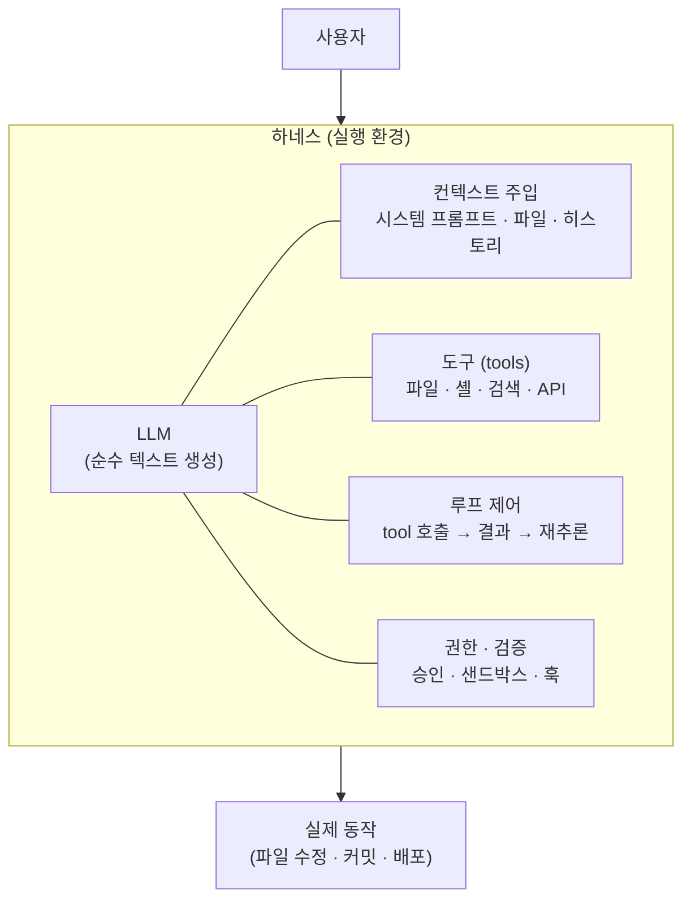
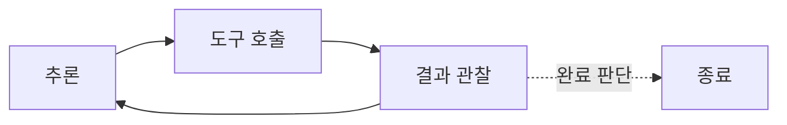
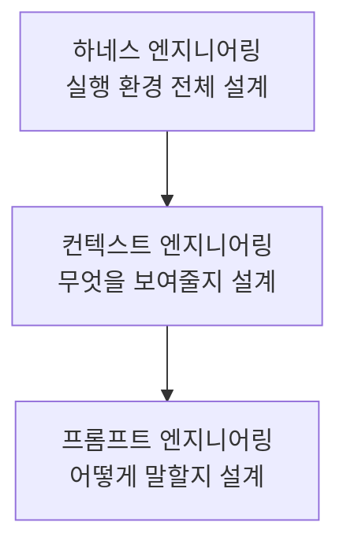

> **TL;DR** — 하네스(harness)는 LLM을 감싸서 실제로 일을 하게 만드는 **바깥 껍데기 전체**입니다. 도구(tool), 컨텍스트 주입, 루프 제어, 권한·검증, 상태 관리를 묶은 실행 환경이죠. 하네스 엔지니어링은 "프롬프트를 잘 쓰는 것"을 넘어 **모델이 안전하고 반복 가능하게 행동하도록 그 껍데기를 설계하는 일**입니다. 같은 모델도 하네스가 다르면 완전히 다른 에이전트가 됩니다.

---

## 1. 하네스란 무엇인가

"하네스(harness)"는 원래 말·낙하산·안전벨트를 잡아주는 **마구(馬具)·결착 장비**를 뜻합니다. 소프트웨어에서는 "테스트 하네스"처럼 **어떤 코드를 실행 가능하게 감싸는 골격**을 가리켜 왔습니다.

LLM 맥락에서 하네스는 **모델(순수 텍스트 생성기)을 실제 작업을 수행하는 에이전트로 바꿔주는 바깥 시스템 전체**입니다.

모델 자체는 텍스트만 뱉습니다. 파일을 고치고, 명령을 실행하고, 결과를 보고 다시 판단하는 **모든 실행 능력은 하네스가 제공**합니다.

---

## 2. 왜 중요한가 — 같은 모델, 다른 에이전트

핵심 통찰은 이것입니다: **모델을 바꾸지 않아도, 하네스를 바꾸면 결과물의 품질이 완전히 달라집니다.**

| 요소 | 모델이 담당 | 하네스가 담당 |
|---|---|---|
| 추론·판단 | ✅ | |
| 어떤 도구가 있는지 | | ✅ |
| 무슨 컨텍스트를 볼지 | | ✅ |
| 몇 번 반복할지 | | ✅ |
| 위험한 행동 차단 | | ✅ |
| 실패 시 재시도 | | ✅ |

똑같은 Claude를 쓰더라도, 도구를 잘 설계하고 컨텍스트를 정확히 주입하고 검증 루프를 잘 짜면 결과가 극적으로 좋아집니다. 이게 **"모델 성능이 아니라 하네스가 병목"**이라는 말의 의미입니다.

프롬프트 엔지니어링이 "모델에게 뭐라고 말할까"였다면, 하네스 엔지니어링은 **"모델이 무엇을 보고, 무엇을 할 수 있고, 어떻게 반복하고, 무엇이 막히는가"를 설계**하는 것입니다.

---

## 3. 하네스의 구성 요소

### 3.1 컨텍스트 주입 (Context)

모델의 컨텍스트 창에 **무엇을 넣을지** 결정합니다. 관련 파일, 시스템 프롬프트, 이전 대화, 프로젝트 규칙(`CLAUDE.md`) 등입니다.

- 너무 적으면 → 모델이 표류하거나 잘못된 가정을 함
- 너무 많으면 → 중요한 지시가 희석되고 비용 폭증

핵심은 **필요한 것만 정확히, 적시에** 넣는 것입니다. 이 영역이 최근 "컨텍스트 엔지니어링"이라 불리는 하네스의 하위 분야입니다.

### 3.2 도구 (Tools)

모델이 환경에 영향을 주는 유일한 통로입니다. 도구 설계가 곧 능력 설계입니다.

- **도구 스키마** — 이름·설명·파라미터가 명확해야 모델이 올바르게 호출
- **입도(granularity)** — 너무 저수준이면 호출 폭발, 너무 고수준이면 유연성 상실
- **에러 메시지** — 실패를 모델이 이해하고 스스로 교정할 수 있게 설계

> 잘 설계된 도구는 "무엇이 잘못됐고 어떻게 고치는지"를 에러로 알려줍니다. 하네스가 모델을 가르치는 지점입니다.

### 3.3 루프 제어 (Agentic Loop)

에이전트의 본질은 루프입니다. **추론 → 도구 호출 → 결과 관찰 → 재추론**을 반복합니다.

하네스는 이 루프를 제어합니다: 언제 멈출지, 몇 번까지 재시도할지, 병렬로 돌릴지, 서브 에이전트에게 위임할지.

### 3.4 권한·검증 (Guardrails)

모델이 위험한 행동을 하지 못하게 막는 안전장치입니다.

- **권한 모드** — 파일 쓰기·명령 실행 전 사용자 승인
- **샌드박스** — 격리된 환경에서만 실행
- **훅(hook)** — 특정 도구 호출을 가로채 검증·차단
- **읽기 전용 에이전트** — 탐색 전용 에이전트에겐 수정 권한을 안 줌

### 3.5 상태 관리 (State)

긴 작업에서 컨텍스트가 넘칠 때 요약·압축하고, 세션 간 상태를 유지하며, 서브 에이전트 결과를 취합합니다.

---

## 4. 프롬프트 vs 컨텍스트 vs 하네스

세 개념은 계층 관계입니다.

| 계층 | 질문 | 예시 |
|---|---|---|
| **프롬프트** | 모델에게 뭐라고 말할까 | 지시문 문구, few-shot 예시 |
| **컨텍스트** | 모델에게 무엇을 보여줄까 | 관련 파일 선택, 히스토리 압축 |
| **하네스** | 모델이 무엇을 할 수 있고 어떻게 반복할까 | 도구·루프·권한·검증 전체 |

프롬프트는 하네스의 한 부품일 뿐입니다. 하네스 엔지니어링은 이 전부를 아우릅니다.

---

## 5. 실제 사례: Claude Code라는 하네스

Claude Code 자체가 잘 설계된 하네스의 예입니다.

| 하네스 요소 | Claude Code에서의 구현 |
|---|---|
| 컨텍스트 주입 | `CLAUDE.md` 자동 로드, 파일 Read |
| 도구 | Read/Edit/Bash/Grep/Glob… |
| 루프 제어 | 에이전트 루프 + 서브 에이전트(`Agent` 도구) |
| 권한·검증 | 권한 모드, hook, plan mode 승인 |
| 상태 관리 | 컨텍스트 요약, 서브 에이전트 격리 |

같은 Claude 모델이라도 이 하네스 위에서 돌면 파일을 고치고 테스트를 돌리고 커밋하는 실제 개발 작업을 수행합니다. 모델은 그대로인데, **하네스가 능력을 부여**하는 것입니다.

> [oh-my-claudecode](/posts/oh-my-claudecode-plugin/) 같은 플러그인은 이 하네스 위에 **또 다른 하네스 레이어**(멀티에이전트 오케스트레이션)를 얹는 셈입니다.

---

## 6. 하네스 설계 원칙

- **도구 에러는 교정 가능하게** — 실패 메시지가 다음 행동을 안내해야 함
- **컨텍스트는 적시·적량** — 필요한 것만, 필요할 때
- **루프에 종료 조건을 명확히** — 무한 반복·조기 종료 모두 방지
- **위험 행동엔 게이트를** — 되돌리기 어려운 작업은 승인·검증 경유
- **검증을 루프 안에 넣어라** — 생성 후 스스로 확인하는 단계를 포함
- **관측 가능하게** — 무엇을 왜 했는지 추적 가능해야 개선됨

---

## 7. 함정 / 주의점

### "모델만 좋으면 된다"

최신 모델을 써도 하네스가 부실하면 결과가 나쁩니다. 반대로 평범한 모델도 좋은 하네스 위에선 놀랍게 잘 동작합니다. **투자 대비 효과는 하네스 쪽이 큰 경우가 많습니다.**

### "도구를 많이 주면 강력해진다"

도구가 많을수록 모델은 선택에 혼란을 겪고 컨텍스트가 무거워집니다. **적고 명확한 도구**가 많고 모호한 도구보다 낫습니다.

### "검증 없이 루프만 돌린다"

생성-실행만 반복하면 틀린 방향으로 빠르게 달려갑니다. 루프 안에 **검증·비평 단계**가 있어야 자기 교정이 됩니다.

---

## 마무리

AI 엔지니어링의 무게 중심은 **프롬프트 → 컨텍스트 → 하네스**로 이동해 왔습니다. 모델의 원시 성능은 상향 평준화되고 있고, 이제 차이를 만드는 건 **그 모델을 무엇으로 감싸느냐**입니다.

하네스 엔지니어링의 본질은 이 한 문장으로 요약됩니다:

> 모델은 두뇌고, 하네스는 그 두뇌가 세상과 상호작용하는 몸이다. 좋은 몸이 좋은 일을 하게 한다.

---

더 궁금한 점은 [GitHub](https://github.com/taengkim)에서 이슈로 남겨주세요!
