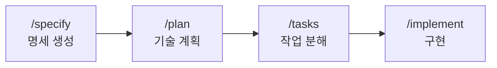

> **TL;DR** — 스펙 주도 개발(Spec-Driven Development, SDD)은 코드를 짜기 전에 **명세(spec)를 먼저 확정하고, 그 명세를 단일 진실 소스로 삼아 AI가 구현**하게 하는 방식입니다. 즉흥적 대화로 코드를 뽑는 "바이브 코딩"의 의도 유실·일관성 붕괴·검증 불가 문제를 해결합니다. 핵심은 **"말로 던지기"에서 "문서로 합의하고 구현하기"로** 옮기는 것입니다.

---

# 1부. 개념

## 1. 바이브 코딩의 한계

"바이브 코딩(vibe coding)"은 AI에게 자연어로 즉흥적으로 지시하며 코드를 뽑아내는 방식입니다. 프로토타입엔 빠르지만 규모가 커지면 문제가 드러납니다.

| 문제 | 증상 |
|---|---|
| **의도 유실** | 대화가 길어지면 AI가 초기 요구사항을 잊고 표류 |
| **일관성 붕괴** | 매번 다른 판단으로 아키텍처가 뒤섞임 |
| **검증 불가** | "맞게 만들었나"를 판단할 기준이 없음 |
| **재현 불가** | 같은 결과를 다시 만들 수 없음 |

문제의 근원은 하나입니다. **진실의 소스가 "가장 최근 프롬프트"라는 점.** 대화는 휘발되고, 판단 기준은 그때그때의 "감(vibe)"에 의존합니다.

## 2. 스펙 주도 개발이란

코드를 짜기 전에 **명세를 먼저 확정하고, 그 명세를 단일 진실 소스(source of truth)로 삼아** AI가 구현하도록 하는 방식입니다. 명세가 "바이브"를 대체합니다.


핵심은 **명세 → 계획 → 작업 → 구현**의 각 단계를 명시적 문서로 남기고, 각 단계가 이전 단계를 근거로 검증된다는 점입니다. 구현이 명세에서 벗어나면 명세로 되돌아가 확인할 수 있습니다.

## 3. 바이브 코딩 vs 스펙 주도 개발

| | 바이브 코딩 | 스펙 주도 개발 |
|---|---|---|
| 시작점 | 즉흥 대화 | 확정된 명세 |
| 진실 소스 | 최근 프롬프트 | 명세 문서 |
| 적합 상황 | 프로토타입·탐색 | 팀·장기 유지보수 |
| 검증 기준 | 없음 (감) | 명세 대비 |
| 재현성 | 낮음 | 높음 |
| AI 표류 | 잦음 | 명세가 앵커 역할 |

**바이브 코딩이 나쁜 건 아닙니다.** 빠른 탐색·프로토타이핑엔 여전히 최적입니다. SDD는 "이걸 팀이 오래 유지보수해야 한다"는 순간 필요해집니다.

## 4. 대표 도구/프레임워크

| 도구 | 특징 |
|---|---|
| **GitHub Spec Kit** | `/specify` → `/plan` → `/tasks` → `/implement` 워크플로우. 오픈소스 |
| **Amazon Kiro** | AWS의 SDD 전용 IDE. requirements/design/tasks 3파일 구조 |
| **Tessl** | "명세가 곧 소스"라는 spec-centric 개발 지향 |
| **Claude Code (plan mode)** | 명시적 계획 승인 후 구현. SDD의 경량 내장 버전 |

---

# 2부. 실전 — SDD 돌리는 법

두 가지 방법을 소개합니다. 하나는 **Claude Code 내장 기능만으로** 하는 경량 SDD, 다른 하나는 **GitHub Spec Kit**을 쓰는 본격 SDD입니다.

## 5. 방법 A — Claude Code만으로 (경량 SDD)

별도 도구 없이 Claude Code의 **plan mode + 마크다운 명세 파일**만으로 SDD의 핵심을 구현할 수 있습니다.

### 단계 1: 명세 파일 작성

먼저 `spec.md`에 "무엇을·왜"를 적습니다. 코드가 아니라 요구사항입니다.

```markdown
# spec.md — 태스크 관리 API

## 목적
팀이 태스크를 생성·조회·완료할 수 있는 REST API.

## 요구사항
- POST /tasks: 태스크 생성 (title 필수, due_date 선택)
- GET /tasks: 목록 조회 (status로 필터)
- PATCH /tasks/{id}: 상태 변경 (todo → done)
- 인증: API 키 헤더 (X-API-Key)

## 제약
- Python 3.12 + FastAPI
- 저장소는 PostgreSQL
- 모든 엔드포인트에 테스트 필수

## 완료 기준 (Definition of Done)
- [ ] 4개 엔드포인트 동작
- [ ] pytest 통과
- [ ] 잘못된 API 키는 401 반환
```

### 단계 2: plan mode로 계획 수립

Claude Code에서 plan mode로 진입해 명세를 기반으로 계획을 세우게 합니다.

```
spec.md를 읽고 구현 계획을 세워줘. 파일 구조, 각 파일의 역할,
구현 순서를 명세의 완료 기준에 맞춰 제시해줘.
```

Claude가 계획을 제시하면 **사람이 검토·승인**합니다. 이 승인 단계가 SDD의 핵심입니다 — 코드를 짜기 전에 방향을 합의합니다.

### 단계 3: 명세를 앵커로 구현

승인 후 구현할 때, 명세를 계속 참조하도록 지시합니다.

```
승인된 계획대로 구현해줘. 각 단계마다 spec.md의 어떤 요구사항을
충족하는지 명시하고, 완료 기준 체크리스트를 갱신해줘.
```

### 단계 4: 명세 대비 검증

```
구현이 spec.md의 완료 기준을 모두 충족하는지 점검하고,
누락된 항목이 있으면 목록화해줘.
```


> `spec.md`를 `CLAUDE.md`에서 참조하도록 걸어두면, 세션이 새로 시작돼도 명세가 컨텍스트에 자동으로 들어옵니다. ([CLAUDE.md 작성 전략](/posts/claude-code-claude-md-strategy/) 참고)

## 6. 방법 B — GitHub Spec Kit (본격 SDD)

더 구조화된 워크플로우가 필요하면 **Spec Kit**을 씁니다. 4단계 슬래시 커맨드로 명세부터 구현까지 관리합니다.

### 설치

```bash
# uvx로 프로젝트 초기화 (Claude Code 연동)
uvx --from git+https://github.com/github/spec-kit.git specify init my-project --ai claude
cd my-project
```

### 4단계 워크플로우



**1) `/specify` — 무엇을 만들지 명세화**

```
/specify 팀 태스크 관리 API. 태스크 CRUD, API 키 인증,
상태별 필터링. 사용자는 태스크를 생성하고 완료 처리할 수 있어야 함.
```

→ `spec.md`가 생성됩니다. "무엇을·왜"에 집중하며, 기술 스택은 아직 정하지 않습니다.

**2) `/plan` — 어떻게 만들지 기술 설계**

```
/plan Python 3.12 + FastAPI + PostgreSQL. SQLAlchemy ORM 사용.
인증은 미들웨어로 처리.
```

→ 아키텍처·데이터 모델·기술 결정을 담은 `plan.md`가 생성됩니다.

**3) `/tasks` — 실행 가능한 작업으로 분해**

```
/tasks
```

→ 계획을 검증 가능한 작은 작업 목록(`tasks.md`)으로 쪼갭니다. 각 작업은 독립적으로 구현·테스트 가능합니다.

**4) `/implement` — 작업 실행**

```
/implement
```

→ 작업 목록을 순서대로 구현합니다. 각 작업이 명세·계획을 근거로 진행됩니다.

## 7. 어떤 방법을 쓸까

| 상황 | 추천 |
|---|---|
| 혼자 하는 중소 프로젝트 | **방법 A** (Claude Code plan mode + spec.md) |
| 팀 협업·장기 유지보수 | **방법 B** (Spec Kit, 명세가 버전 관리됨) |
| 빠른 프로토타입 | 그냥 바이브 코딩 (SDD 오버헤드 불필요) |

## 8. 함정 / 주의점

### "명세를 너무 상세히 쓴다"

명세는 "무엇을·왜"이지 "코드 그 자체"가 아닙니다. 구현 세부까지 명세에 박으면 유연성이 사라지고 명세 유지보수가 부담이 됩니다. **검증 가능한 완료 기준** 수준이 적당합니다.

### "명세를 한 번 쓰고 방치한다"

구현 중 요구사항이 바뀌면 **명세를 먼저 고치고** 구현을 진행해야 합니다. 명세와 코드가 어긋나면 SDD의 진실 소스가 무너집니다.

### "모든 것에 SDD를 적용한다"

한 줄 수정, 프로토타입, 일회성 스크립트에까지 SDD를 씌우면 오버엔지니어링입니다. **오래 유지보수할 코드**에만 적용하세요.

---

## 마무리

스펙 주도 개발의 본질은 **AI에게 무엇을 만들지 "말로 던지는 것"에서 "문서로 합의하고 구현하는 것"으로** 옮기는 것입니다.

바이브 코딩은 탐색과 프로토타입에서 여전히 강력합니다. 하지만 "이걸 팀이 오래 유지보수해야 한다"는 순간, 명세라는 앵커가 필요해집니다. Claude Code의 plan mode는 이미 이 철학의 경량 버전을 내장하고 있으니, 거창한 도구 없이도 오늘 바로 시작할 수 있습니다.

> 감(vibe)으로 시작하되, 명세(spec)로 완성하세요.

---

더 궁금한 점은 [GitHub](https://github.com/taengkim)에서 이슈로 남겨주세요!
