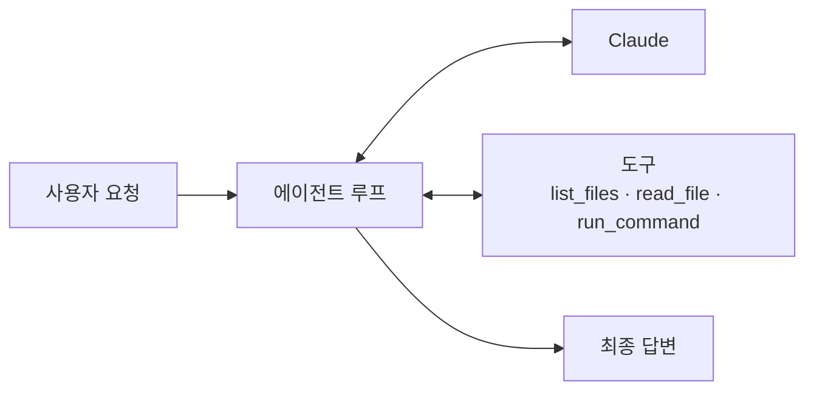
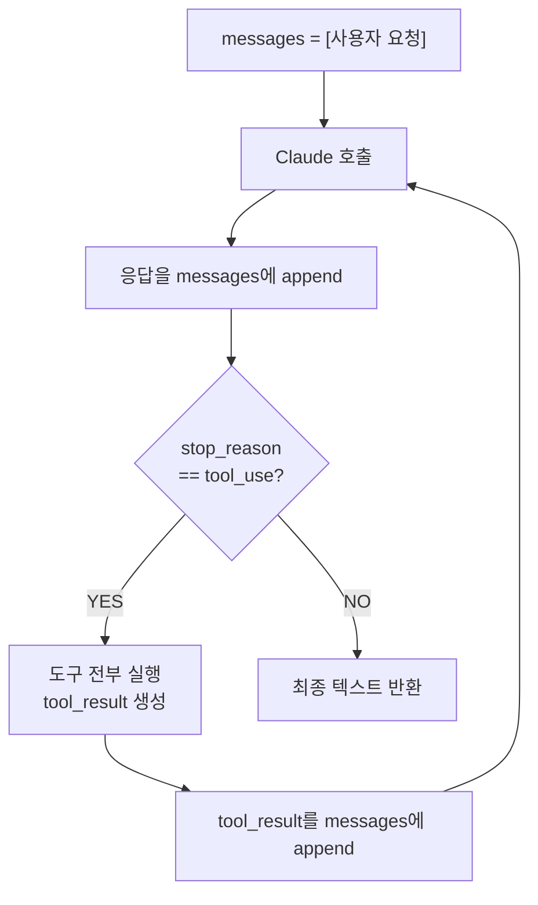
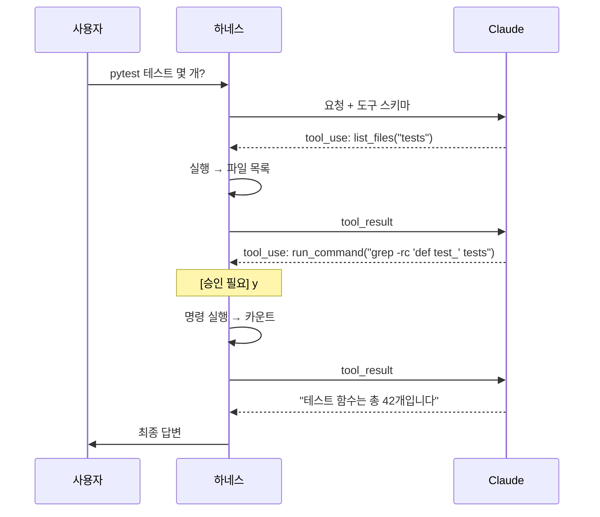

> **TL;DR** — 하네스의 핵심은 **에이전트 루프**입니다: 모델에게 도구를 주고 → 모델이 도구를 호출하면 → 실행해서 결과를 돌려주고 → 다시 모델에게 판단을 맡기는 반복이죠. 이 글에서는 Anthropic SDK로 파일을 읽고 명령을 실행하는 **최소 코드 에이전트 하네스**를 처음부터 만들어 봅니다. 도구 정의, 루프 제어, 승인 게이트, 검증까지 100줄 안에 담습니다.

이 글은 [하네스 엔지니어링 개념글](/posts/harness-engineering/)의 실전편입니다. 개념을 코드로 옮깁니다.

---

## 1. 만들 것 — 미니 코드 에이전트

"이 프로젝트에 테스트가 몇 개야?" 같은 요청을 받으면, 에이전트가 스스로 파일을 뒤지고 명령을 돌려 답하는 하네스를 만듭니다.



핵심은 **모델은 도구 호출만 하고, 실제 실행은 하네스(우리 코드)가 한다**는 점입니다. 개념글에서 강조한 그 분리를 코드로 구현합니다.

---

## 2. 도구 정의 — 능력 설계

먼저 모델에게 어떤 능력을 줄지 정합니다. 도구 스키마가 곧 능력의 경계입니다.

```python
TOOLS = [
    {
        "name": "list_files",
        "description": "디렉토리의 파일·하위 디렉토리 목록을 반환한다. 코드베이스 구조 파악에 사용.",
        "input_schema": {
            "type": "object",
            "properties": {
                "path": {"type": "string", "description": "조회할 디렉토리 경로 (예: 'src')"},
            },
            "required": ["path"],
        },
    },
    {
        "name": "read_file",
        "description": "파일 내용을 문자열로 반환한다. 구현을 확인할 때 사용.",
        "input_schema": {
            "type": "object",
            "properties": {
                "path": {"type": "string", "description": "읽을 파일 경로"},
            },
            "required": ["path"],
        },
    },
    {
        "name": "run_command",
        "description": "셸 명령을 실행하고 stdout/stderr를 반환한다. 테스트 실행·집계 등에 사용.",
        "input_schema": {
            "type": "object",
            "properties": {
                "command": {"type": "string", "description": "실행할 셸 명령"},
            },
            "required": ["command"],
        },
    },
]
```

> **설계 포인트**: `description`에 "언제 쓰는지"를 함께 적습니다. 최신 모델은 "무엇을 하는지"보다 "언제 호출할지"를 도구 설명에서 판단하므로, 트리거 조건을 명시하면 호출 정확도가 올라갑니다.

---

## 3. 도구 실행기 — 하네스의 손

모델이 도구를 호출하면 실제로 실행하는 함수입니다. **여기가 안전장치가 들어가는 곳**입니다.

```python
import subprocess
from pathlib import Path

ROOT = Path("/workspace/project").resolve()  # 작업 경계

def safe_path(path: str) -> Path:
    """경로가 작업 루트를 벗어나지 못하게 강제."""
    resolved = (ROOT / path).resolve()
    if not resolved.is_relative_to(ROOT):
        raise ValueError(f"작업 루트 밖 접근 차단: {path}")
    return resolved

def execute_tool(name: str, args: dict) -> str:
    if name == "list_files":
        p = safe_path(args["path"])
        return "\n".join(sorted(x.name for x in p.iterdir()))

    if name == "read_file":
        return safe_path(args["path"]).read_text()[:20000]  # 컨텍스트 보호

    if name == "run_command":
        # 승인 게이트: 되돌리기 어려운 행동은 사람 확인
        if not approve(args["command"]):
            return "사용자가 명령 실행을 거부했습니다."
        result = subprocess.run(
            args["command"], shell=True, cwd=ROOT,
            capture_output=True, text=True, timeout=30,
        )
        return f"exit={result.returncode}\nstdout:\n{result.stdout}\nstderr:\n{result.stderr}"

    return f"알 수 없는 도구: {name}"

def approve(command: str) -> bool:
    answer = input(f"\n[승인 필요] 실행할까요? → {command}\n(y/N) ")
    return answer.strip().lower() == "y"
```

세 가지 안전장치가 들어갔습니다:
- **경로 샌드박싱** (`safe_path`) — 작업 루트 밖 파일 접근 차단
- **출력 크기 제한** (`[:20000]`) — 대용량 파일이 컨텍스트를 잡아먹지 않게
- **승인 게이트** (`approve`) — 명령 실행처럼 되돌리기 어려운 행동은 사람이 확인

---

## 4. 에이전트 루프 — 하네스의 심장

이제 핵심입니다. 모델을 호출하고, 도구 호출이 있으면 실행해서 돌려주고, 없으면 종료합니다.

```python
import anthropic

client = anthropic.Anthropic()

def run_agent(user_request: str, max_turns: int = 20) -> str:
    messages = [{"role": "user", "content": user_request}]

    for turn in range(max_turns):
        response = client.messages.create(
            model="claude-opus-5",
            max_tokens=4096,
            thinking={"type": "adaptive"},   # 필요할 때 스스로 추론
            system="너는 코드베이스 분석 에이전트다. 도구로 사실을 확인한 뒤 답하라.",
            tools=TOOLS,
            messages=messages,
        )

        # 모델 응답(도구 호출 포함)을 히스토리에 그대로 append
        messages.append({"role": "assistant", "content": response.content})

        # 도구 호출이 없으면 = 최종 답변
        if response.stop_reason != "tool_use":
            return "".join(b.text for b in response.content if b.type == "text")

        # 도구 호출을 모두 실행해서 결과를 한 번에 돌려준다
        tool_results = []
        for block in response.content:
            if block.type == "tool_use":
                try:
                    output = execute_tool(block.name, block.input)
                    tool_results.append({
                        "type": "tool_result",
                        "tool_use_id": block.id,
                        "content": output,
                    })
                except Exception as e:
                    tool_results.append({
                        "type": "tool_result",
                        "tool_use_id": block.id,
                        "content": f"도구 실행 오류: {e}",
                        "is_error": True,   # 실패도 모델이 스스로 교정하게
                    })

        messages.append({"role": "user", "content": tool_results})

    return "최대 턴 수를 초과했습니다."
```



---

## 5. 루프에서 지켜야 할 4가지 규칙

이 짧은 루프에 하네스 설계의 핵심이 압축돼 있습니다.

### ① 응답 전체(`response.content`)를 append 한다

텍스트만 뽑아 넣으면 `tool_use` 블록이 사라져 다음 턴에서 도구 호출과 결과가 짝이 안 맞습니다. **반드시 `content` 전체**를 넣습니다.

### ② 도구 결과는 한 번의 user 메시지로 모아 보낸다

한 응답에 도구 호출이 여러 개(병렬)일 수 있습니다. 각 `tool_result`에 `tool_use_id`를 붙여 **하나의 user 메시지**로 묶어 보냅니다. 나눠 보내면 모델이 병렬 호출을 그만두도록 학습됩니다.

### ③ 실패도 결과로 돌려준다 (`is_error: true`)

도구가 실패해도 그냥 던지지 말고 `is_error: true`로 돌려줍니다. 그래야 모델이 "아, 경로가 틀렸구나" 하고 **스스로 교정**합니다. 잘 설계된 에러 메시지는 하네스가 모델을 가르치는 지점입니다.

### ④ 루프에 종료 조건을 둔다 (`max_turns`)

`stop_reason != "tool_use"`면 정상 종료, `max_turns` 초과면 강제 종료. **무한 루프 방지**는 하네스의 책임입니다.

---

## 6. 실행 예시

```python
answer = run_agent("이 프로젝트에 pytest 테스트 함수가 몇 개인지 세줘.")
print(answer)
```

내부에서 벌어지는 일:



모델이 **스스로 탐색 전략을 세우고**(목록 확인 → grep 실행), 하네스는 실행과 안전만 책임집니다.

---

## 7. 여기서 하네스를 키우는 방향

이 100줄이 뼈대입니다. 실전 하네스는 여기에 계층을 더합니다.

| 추가 계층 | 무엇을 얻나 | 어떻게 |
|---|---|---|
| **검증 루프** | 자기 교정 | 최종 답 전에 "근거를 도구 결과로 확인했나" 재확인 단계 추가 |
| **컨텍스트 관리** | 긴 작업 지속 | 히스토리가 길어지면 요약·압축 (context editing / compaction) |
| **서브 에이전트** | 병렬·격리 | 독립 탐색을 별도 루프에 위임하고 결과만 회수 |
| **Tool Runner** | 루프 자동화 | 직접 루프를 짜는 대신 SDK의 tool runner로 위임 |
| **프롬프트 캐싱** | 비용 절감 | 고정 system·도구 스키마에 `cache_control` 부여 |

특히 루프를 직접 관리하고 싶지 않다면, Anthropic SDK의 **Tool Runner**(`client.beta.messages.tool_runner`)가 이 루프를 대신 돌려줍니다. 승인 게이트·에러 가로채기 같은 훅도 그대로 제공하므로, 대부분의 경우 직접 루프를 짜는 것보다 낫습니다. 이 글처럼 **루프 전체를 직접 소유**하고 싶을 때만 수동 루프를 씁니다.

---

## 8. 함정 / 주의점

### 도구를 너무 많이 주지 않기

`list_files`, `read_file`, `run_command` 세 개로 대부분의 코드 탐색이 됩니다. 도구가 많을수록 모델은 선택에 혼란을 겪고 컨텍스트가 무거워집니다. **적고 명확한 도구**가 낫습니다.

### `run_command` 하나가 사실상 만능

셸을 열어주면 모델은 거의 모든 걸 할 수 있습니다. 편하지만 위험합니다. 승인 게이트를 반드시 두고, 프로덕션에서는 **허용 명령 화이트리스트**나 격리 환경(컨테이너)에서 실행하세요.

### 컨텍스트 폭발 주의

`read_file` 출력을 자르지 않으면 대용량 파일 하나가 컨텍스트를 통째로 잡아먹습니다. 크기 제한은 선택이 아니라 필수입니다.

---

## 마무리

하네스는 거창한 프레임워크가 아니라 **"모델 호출 → 도구 실행 → 결과 반환"의 루프에 안전장치를 두른 것**입니다. 이 글의 100줄이 그 뼈대 전부입니다.

개념글에서 말한 "모델은 두뇌, 하네스는 몸"이 코드로는 이렇게 나타납니다:

> 모델은 `tool_use`로 "무엇을 할지" 결정하고, 하네스는 `execute_tool`로 "실제로 그 일을 하고" 안전을 책임진다.

여기서부터 검증 루프·서브 에이전트·컨텍스트 관리를 얹어 가면, 그게 바로 Claude Code 같은 실전 하네스가 됩니다.

---

더 궁금한 점은 [GitHub](https://github.com/taengkim)에서 이슈로 남겨주세요!
