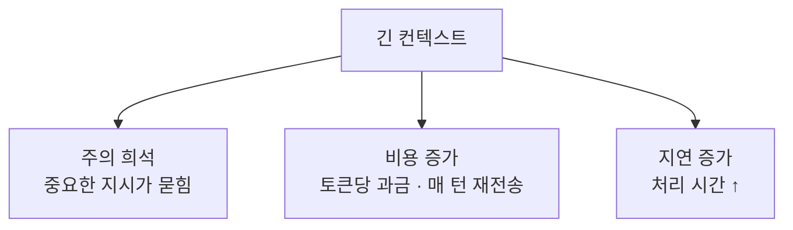
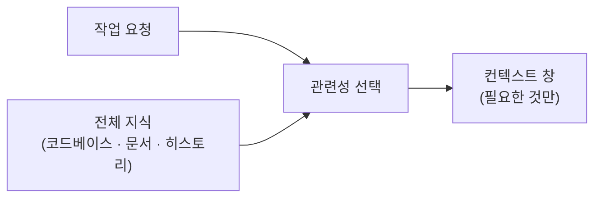
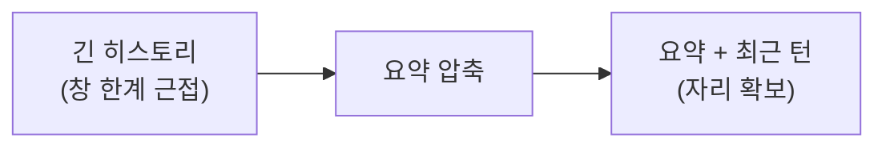
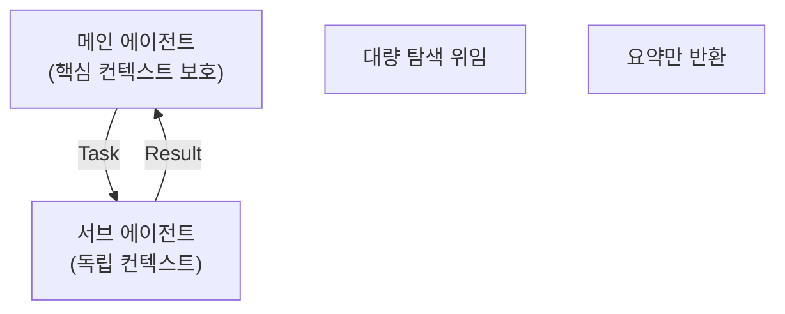
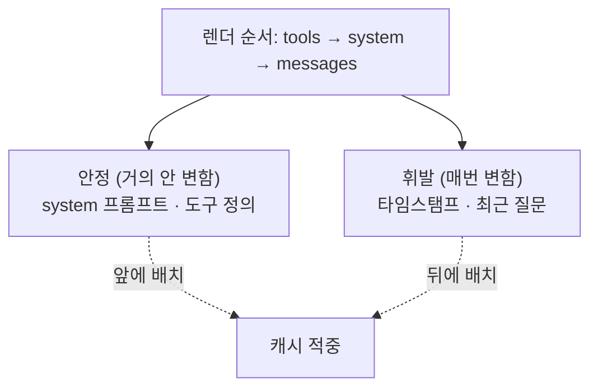

> **TL;DR** — 컨텍스트 엔지니어링은 [하네스](/posts/harness-engineering/)의 하위 분야로, **모델의 컨텍스트 창에 정확히 무엇을 넣을지** 설계하는 일입니다. 창은 유한하고, 길어질수록 주의(attention)가 흐려지고 비용이 오릅니다. 핵심 기법은 네 가지 — **선택(retrieval)**, **압축(compaction)**, **정리(context editing)**, **격리(sub-agent)** — 이고, 여기에 비용을 좌우하는 **프롬프트 캐싱**의 제약이 겹칩니다.

이 글은 [하네스 엔지니어링](/posts/harness-engineering/) 시리즈의 심화편입니다. 하네스의 5개 구성 요소 중 "컨텍스트 주입"을 깊게 파고듭니다.

---

## 1. 왜 컨텍스트가 병목인가

"컨텍스트 창이 크면 다 넣으면 되지 않나?"가 첫 오해입니다. 창이 1M 토큰이어도 **다 채우는 건 나쁜 전략**입니다. 세 가지 이유:

- **주의 희석** — 컨텍스트가 길수록 정말 중요한 지시(제약·규칙)가 노이즈에 묻힙니다. 모델은 모든 토큰을 동등한 신호로 취급하므로, 관련 없는 내용이 판단을 흐립니다.
- **비용** — 에이전트 루프는 매 턴 전체 히스토리를 다시 보냅니다. 창이 길면 그 재전송 비용이 매 턴 누적됩니다.
- **지연** — 입력 토큰이 많을수록 첫 응답까지 시간이 늘어납니다.

> 컨텍스트 엔지니어링의 목표는 **"많이 넣기"가 아니라 "신호 대 잡음비를 높이기"**입니다.

---

## 2. 핵심 질문: 신호와 잡음

컨텍스트 창을 예산이라고 생각하면, 모든 항목이 자리값을 해야 합니다.

| 넣어야 할 것 (신호) | 빼야 할 것 (잡음) |
|---|---|
| 지금 작업에 직접 관련된 파일·코드 | "혹시 몰라서" 넣은 전체 디렉토리 |
| 지켜야 할 제약·규칙 | 자명한 배경 설명 |
| 최근에 확정된 결정 | 이미 처리 완료된 오래된 도구 결과 |
| 재사용될 요약 | 중복·반복된 지시 |

핵심은 **"모델이 이 토큰을 봐서 다음 행동이 달라지는가?"**입니다. 답이 "아니오"면 잡음입니다.

---

## 3. 기법 1 — 선택 (Retrieval)

컨텍스트에 **무엇을 넣을지 고르는** 단계입니다. 가장 근본적인 기법입니다.

- **적을 때** — 모델이 표류하거나 잘못된 가정을 합니다.
- **많을 때** — 중요한 지시가 희석되고 비용이 폭증합니다.

에이전트 하네스에서는 이 선택을 **모델 스스로** 하게 하는 게 강력합니다. 전체 파일을 미리 다 넣는 대신, `read_file`·`grep` 같은 도구를 주고 **필요할 때 스스로 가져오게** 합니다. Claude Code가 코드베이스를 미리 다 로드하지 않고 그때그때 읽는 이유입니다.

> **Tool Search / Skill 패턴**: 도구가 아주 많으면 스키마를 전부 컨텍스트에 올리지 않고, 검색으로 필요한 것만 불러옵니다. 지시문도 마찬가지 — Skill은 요약만 상주시키고 전체는 필요할 때 읽습니다. "필요할 때 로드"가 핵심입니다.

---

## 4. 기법 2 — 압축 (Compaction)

긴 대화가 창 한계에 다가가면, 오래된 내용을 **요약해 자리를 비웁니다.**

- 원리: 과거 턴을 **요약 블록**으로 대체해 의미는 보존하되 토큰을 줄입니다.
- 주의: 요약은 **손실 압축**입니다. 무엇을 남기고 버릴지가 품질을 좌우합니다.

에이전트 관점에서 압축은 "긴 작업을 끝까지 지속"하게 하는 장치입니다. Anthropic API는 서버측 compaction을 지원하고, Claude Code도 컨텍스트가 차면 자동 요약합니다.

---

## 5. 기법 3 — 정리 (Context Editing)

압축이 "요약"이라면, 정리는 **"삭제"**입니다. 더 이상 관련 없는 오래된 도구 결과·사고 과정을 컨텍스트에서 **제거**합니다.

| | 압축 (Compaction) | 정리 (Context Editing) |
|---|---|---|
| 방식 | 요약해서 대체 | 그냥 제거 |
| 대상 | 과거 대화 전체 | 오래된 tool_result · thinking 블록 |
| 언제 | 창 한계 근접 시 | 낡은 결과가 쌓일 때 |

예를 들어 20번의 파일 읽기 중 처음 몇 개는 이미 판단에 반영됐고 더 볼 일이 없습니다. 이런 낡은 `tool_result`를 정리하면 **대화 구조는 유지한 채** 창을 가볍게 유지합니다.

---

## 6. 기법 4 — 격리 (Sub-agent)

가장 강력한 기법입니다. 무거운 탐색을 **별도 컨텍스트**에 위임하고, 결과 요약만 회수합니다.

"src/** 에서 deprecated API 다 찾아줘" 같은 작업은 수십 개 파일을 읽어야 합니다. 이걸 메인 컨텍스트에서 하면 창이 파일 내용으로 가득 찹니다. 대신 **서브 에이전트에게 위임**하면:

- 서브 에이전트가 자기 컨텍스트에서 대량 파일을 읽고
- **결과 요약(단일 메시지)만** 메인에 돌려줍니다.

메인 컨텍스트는 파일 내용이 아니라 **결론만** 받습니다. 이것이 [하네스 글](/posts/harness-engineering/)에서 말한 "컨텍스트 보호"의 구체적 메커니즘입니다.

---

## 7. 겹치는 제약 — 프롬프트 캐싱

위 기법들은 **프롬프트 캐싱**과 상호작용합니다. 캐싱은 비용을 크게 줄이지만, **접두사(prefix) 일치**로 동작하는 강한 제약이 있습니다.

**핵심 규칙**: 접두사의 단 1바이트라도 바뀌면 그 뒤 전체 캐시가 무효화됩니다. 그래서:

- **안정된 내용**(system 프롬프트, 도구 목록)은 **앞에** 둔다.
- **휘발성 내용**(현재 시각, 세션 ID, 매번 다른 질문)은 **뒤에** 둔다.
- system 프롬프트에 `datetime.now()`를 끼워 넣으면 매 요청 캐시가 깨진다 — 대표적 실수.

즉 컨텍스트 엔지니어링은 "무엇을 넣나"뿐 아니라 **"어떤 순서로 넣나"**까지 설계합니다. 순서를 잘못 잡으면 캐싱이 통째로 무력화됩니다.

---

## 8. 함정 / 흔한 실수

### "일단 다 넣어두면 안전하다"

가장 흔한 실수입니다. 관련 없는 파일·문서를 "혹시 몰라서" 넣으면, 신호가 잡음에 묻혀 **오히려 품질이 떨어집니다.** 컨텍스트는 클수록 좋은 게 아닙니다.

### "요약하면 정보가 사라진다고 압축을 안 한다"

압축을 피하면 창이 넘쳐 작업이 중단됩니다. 손실을 두려워하지 말고 **무엇을 남길지**를 설계하세요. 완벽한 보존보다 지속 가능한 진행이 낫습니다.

### "system 프롬프트에 동적 값을 넣는다"

`현재 시각: {now}`, `사용자: {user_id}`를 system 프롬프트 앞부분에 넣으면 캐시가 매번 깨집니다. 동적 값은 **메시지 뒤쪽**으로 옮기세요.

### "서브 에이전트에 컨텍스트를 안 넘긴다"

서브 에이전트는 **독립 컨텍스트**라 메인의 대화를 못 봅니다. 위임할 때 필요한 정보를 프롬프트에 **명시적으로** 담아야 합니다. "아까 그거"는 서브 에이전트에게 통하지 않습니다.

---

## 9. 종합 — Claude Code의 컨텍스트 관리

이 기법들이 실제로 어떻게 조합되는지, Claude Code를 보면 됩니다.

| 기법 | Claude Code에서 |
|---|---|
| **선택** | 파일을 미리 로드하지 않고 `Read`/`Grep`로 필요할 때 가져옴 |
| **압축** | 컨텍스트가 차면 자동 요약 |
| **정리** | 오래된 도구 결과 정리 |
| **격리** | `Agent` 도구로 서브 에이전트에 탐색 위임, 요약만 회수 |
| **캐싱** | 고정 system·도구를 앞에 둬 캐시 적중률 유지 |
| **지속** | `CLAUDE.md`로 세션 간 프로젝트 컨텍스트 유지 |

같은 Claude 모델이라도 이 컨텍스트 관리가 있고 없고에 따라 **대규모 코드베이스를 다룰 수 있느냐**가 갈립니다.

---

## 마무리

컨텍스트 엔지니어링의 본질은 한 문장입니다:

> 컨텍스트 창은 무한한 저장소가 아니라 **유한한 작업대**다. 지금 필요한 것만 올려두고, 끝난 것은 치운다.

프롬프트 엔지니어링이 "무슨 말을 할까", 하네스 엔지니어링이 "무엇을 할 수 있게 할까"라면, 컨텍스트 엔지니어링은 그 사이에서 **"무엇을, 어떤 순서로, 언제까지 보여줄까"**를 설계합니다. 모델의 원시 성능이 상향 평준화될수록, 이 설계가 결과를 가릅니다.

---

더 궁금한 점은 [GitHub](https://github.com/taengkim)에서 이슈로 남겨주세요!
