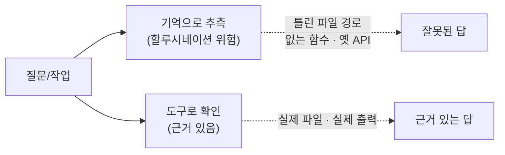
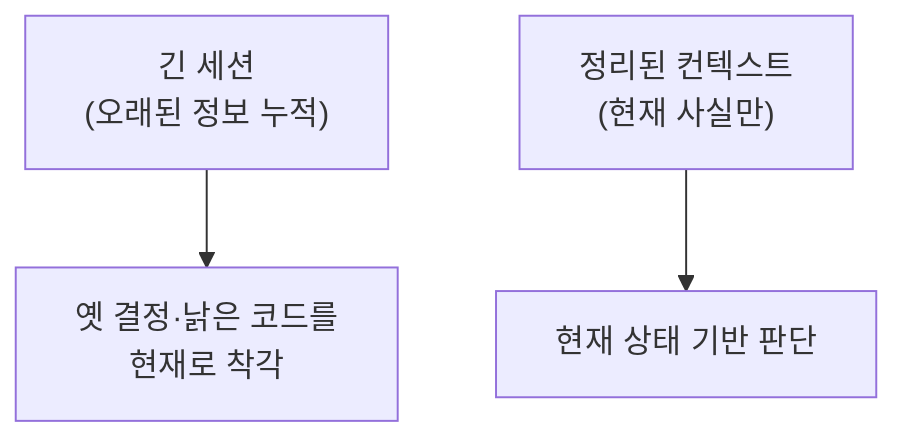
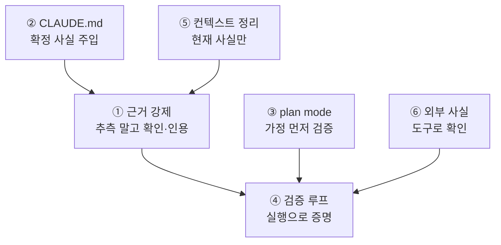

> **TL;DR** — LLM의 할루시네이션은 **모델이 근거 없이 기억으로 답할 때** 생깁니다. Claude Code는 [하네스](/posts/harness-engineering/)이므로, "기억으로 답하기"를 "도구로 확인하고 답하기"로 바꾸면 대부분 사라집니다. 핵심은 다섯 가지 — **근거 강제**, **CLAUDE.md로 사실 주입**, **plan mode로 가정 검증**, **검증 루프**, **컨텍스트 정리**. 프롬프트 요령이 아니라 **하네스를 설계하는** 관점입니다.

이 글은 [하네스 엔지니어링](/posts/harness-engineering/) 시리즈의 실전 활용편입니다.

---

## 1. 왜 할루시네이션이 생기나

할루시네이션은 모델이 **모르는 것을 아는 척** 지어내는 현상입니다. 근본 원인은 하나입니다.



Claude Code는 **도구를 가진 하네스**입니다. 파일을 읽고, 명령을 돌리고, 검색할 수 있죠. 그런데도 할루시네이션이 나는 건, 모델이 **도구를 쓰지 않고 기억으로 답할 때**입니다. 예: 파일을 안 읽고 "아마 이 함수가 있을 겁니다"라고 추측.

> 해법의 방향은 명확합니다: **기억으로 답하지 말고, 도구로 확인하고 답하게** 만드는 것. 이게 하네스 관점의 할루시네이션 대책입니다.

---

## 2. 기법 1 — 근거를 강제하라

가장 직접적인 방법. 답하기 전에 **실제로 확인하라고** 지시합니다.

**나쁜 요청:**
```
이 프로젝트 인증은 어떻게 처리돼?
```
→ 모델이 코드를 안 읽고 일반론으로 답할 수 있음.

**좋은 요청:**
```
이 프로젝트의 인증 처리를 관련 파일을 실제로 읽고 설명해줘.
추측하지 말고, 근거가 되는 파일·라인을 인용해.
```
→ 모델이 `Read`/`Grep`으로 실제 코드를 확인한 뒤 답함.

핵심 문구:
- **"추측하지 말고 확인해"**
- **"근거 파일·라인을 인용해"**
- **"모르면 모른다고 해"**

마지막 문구가 특히 중요합니다. 모델에게 "모른다"는 **허용된 답**이라고 알려주면, 지어내기보다 확인하거나 실토합니다.

---

## 3. 기법 2 — CLAUDE.md로 사실을 주입하라

할루시네이션의 절반은 **프로젝트 맥락을 모를 때** 생깁니다. 모델이 "이 프로젝트는 아마 React겠지"라고 가정하면 틀립니다.

`CLAUDE.md`에 **확정된 사실**을 박아두면 추측할 여지가 사라집니다.

```markdown
## 기술 스택
- 백엔드: Python 3.12 + FastAPI (Flask 아님)
- DB: PostgreSQL 15, ORM은 안 씀 — raw SQL
- 테스트: pytest, `tests/` 하위

## 주의
- API 클라이언트는 `src/client.py`의 `ApiClient`만 사용
- 레거시 `utils/old_http.py`는 쓰지 말 것 (deprecated)
```

이렇게 하면 모델이 "Flask일 것", "requests 쓸 것" 같은 잘못된 가정을 하지 않습니다. 세션마다 자동 로드되므로 매번 설명할 필요도 없습니다.

> CLAUDE.md 작성법은 [별도 글](/posts/claude-code-claude-md-strategy/)에서 깊게 다뤘습니다. 핵심은 **"코드만 봐선 모르는 사실"**을 적는 것입니다.

---

## 4. 기법 3 — plan mode로 가정을 먼저 검증하라

큰 작업일수록, **구현 전에 계획을 검토**하면 잘못된 가정을 조기에 잡습니다.


plan mode에서 Claude가 "`config.yaml`을 수정해서..."라고 하는데 실제로 그 파일이 `config.yml`이라면, **구현 전에** 발견됩니다. 코드를 다 짜고 나서 틀린 걸 아는 것보다 훨씬 낫습니다.

계획 단계에서 특히 이렇게 물어보세요:
```
이 계획이 전제하는 가정을 나열해줘.
확실하지 않은 부분은 실제 파일을 확인하고 표시해줘.
```

---

## 5. 기법 4 — 검증을 루프 안에 넣어라

가장 강력합니다. 생성만 하지 말고, **스스로 검증하게** 합니다.

| 검증 없음 (위험) | 검증 있음 (안전) |
|---|---|
| "구현했습니다" | "구현하고 `pytest` 돌려 통과 확인했습니다" |
| "이 함수 고쳤어요" | "고치고 실제 호출해 출력 확인했어요" |
| "설정 바꿨습니다" | "바꾸고 앱 재시작해 정상 동작 확인했어요" |

지시 방법:
```
구현 후 반드시 테스트를 실행해 통과를 확인하고,
실패하면 원인을 찾아 고친 다음 다시 확인해.
"됐다"고 하기 전에 실제 출력으로 증명해.
```

이러면 모델의 "됐습니다"가 **추측이 아니라 실제 실행 결과**에 근거하게 됩니다. 할루시네이션한 코드는 테스트에서 걸립니다.

> 이것이 [하네스 글](/posts/harness-engineering/)에서 말한 "검증을 루프 안에 넣어라" 원칙의 실천입니다. 생성-실행만 반복하면 틀린 방향으로 빠르게 달려갑니다.

---

## 6. 기법 5 — 컨텍스트를 정리하라

역설적이지만, **컨텍스트가 너무 길어도** 할루시네이션이 늘어납니다. 관련 없는 정보가 쌓이면 모델이 오래된·무관한 내용을 근거로 착각합니다.



실천:
- **긴 세션은 주기적으로** `/clear` 또는 요약 후 새 세션
- 작업이 바뀌면 이전 탐색 내용을 끌고 가지 말 것
- 큰 탐색은 **서브 에이전트에 위임**해 메인 컨텍스트를 깨끗하게 유지

> 컨텍스트 관리는 [컨텍스트 엔지니어링 심화](/posts/context-engineering-deep-dive/)에서 자세히 다뤘습니다.

---

## 7. 기법 6 — 외부 사실은 도구로 확인시켜라

라이브러리 API·버전·최신 문서처럼 **모델의 학습 시점 이후** 정보는 할루시네이션이 잦습니다. 기억 대신 **실제 소스를 보게** 하세요.

- **API·라이브러리 사용법** → 실제 소스나 공식 문서를 읽게 하거나, 관련 스킬/MCP를 붙임
- **최신 정보** → 웹 검색 MCP로 확인
- **설치된 버전** → "`pip show <패키지>`로 실제 버전 확인하고 그에 맞게 짜"

```
이 라이브러리 사용법은 기억에 의존하지 말고,
설치된 버전을 확인한 뒤 실제 소스나 공식 문서를 근거로 작성해.
```

특히 Anthropic API처럼 자주 바뀌는 것은, 모델의 기억이 낡았을 수 있으니 **반드시 실제 문서를 확인**하도록 지시하는 게 안전합니다.

---

## 8. 종합 — 할루시네이션 방지 체크리스트



실전 요약:

- [ ] **"추측하지 말고 확인해, 근거를 인용해, 모르면 모른다고 해"** 를 요청에 넣는다
- [ ] `CLAUDE.md`에 기술 스택·금지사항 등 확정 사실을 박는다
- [ ] 큰 작업은 plan mode로 가정을 먼저 검증한다
- [ ] "테스트 돌려 통과 확인하고, 실제 출력으로 증명해" 를 지시한다
- [ ] 긴 세션은 정리하고, 큰 탐색은 서브 에이전트에 위임한다
- [ ] 라이브러리·최신 정보는 기억 말고 실제 소스·문서를 보게 한다

---

## 마무리

할루시네이션 대책의 핵심은 **프롬프트 요령이 아니라 하네스 설계**입니다.

> 모델이 지어내는 건, 확인할 방법이 없거나 확인하라는 지시가 없을 때다. 확인을 강제하면 지어낼 이유가 사라진다.

Claude Code는 이미 파일을 읽고 명령을 돌리고 검증할 수 있는 **강력한 하네스**입니다. 그 능력을 쓰게 만드는 것 — "기억으로 답하지 말고 도구로 확인하고 답하라" — 가 할루시네이션을 줄이는 가장 확실한 길입니다.

---

더 궁금한 점은 [GitHub](https://github.com/taengkim)에서 이슈로 남겨주세요!
